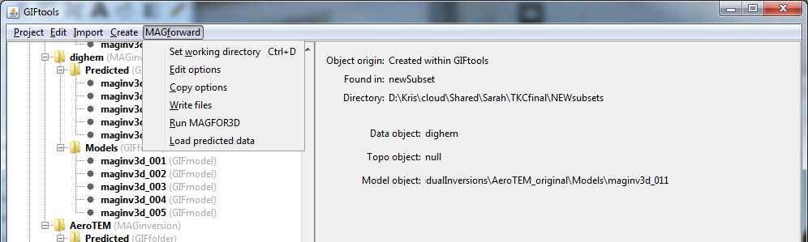

.. _fwdCopyOptions:

.. include:: <isonum.txt>

Copy a forward modeling item
============================

Once the forward model has run and the results loaded, GIFtools does not allow the straight copying of the forward modeling items (it has been "archived"). It does, however, allow you to copy the options that were chosen for the forward model to a new one. Click on the forward modeling item, select the menu showing its class (e.g., ``E3Dforward`` or ``GRAVforward``):

**[Forward model class]** |rarr| **Copy options**

