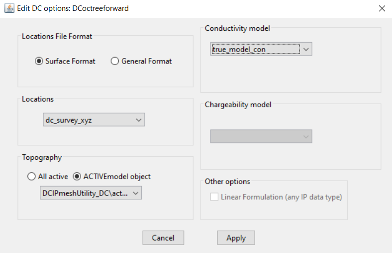

.. _fwdEditOptions_dcip:

.. include:: <isonum.txt>

Edit Options for DCIP Forward Modeling Objects
**********************************************

.. _fwdEditOptions_dcip2d:

DCIP2D
======

This functionality is responsible for setting all forward modeling parameters pertaining to the "DC2Dforward" and "IP2Dforward" forward modeling codes; see `DCIP2D online manual <http://dcip2d.readthedocs.io/en/latest/index.html>`__ . Within the edit options window, the user may set the following parameters:

    - **Locations:** Observation locations or observed data object. This object contains the electrode locations.

    - **Topography:** Sets topography as

    	- *Default:* Sets topography assuming all electrode are located on the Earth's surface
    	- *Value:* Set the surface to the specified elevation value
    	- *Object:* A 2D topography data object

    - **Conductivity Model:** Set the conductivity model (required for "DC2Dforward" and "IP2Dforward" objects)

    - **Chargeability Model:** Set the chargeability model (not required for "DC2Dforward" objects)

    - **Wave:** To solve the 2D problem, the problem must be solved in the wave domain. *N* specifies the number of log-distribution waves numbers used between *Min* and *Max*. The default is set to: *N* = 13, *Min* = 2.5e-4 and *Max* = 1.

    - **Other options (IP only):** For IP forward modeling, the user may specify if the IP data are computed using a non-linear method or by a linear approximation (in which case the sensitivity is stored).

        - **Non-linear:** In this case, the forward modeling operator is non-linear with respect to the model. The input model is an intrinsic chargeability model (:math:`\eta \in [0,1]`). The output data are the apparent intrinsic chargeabilities.

        - **Linear:** In this case, we assume the chargeability is sufficiently small. The forward modeling operator becomes approximately linear with respect to the model. The input model can be any representation of intrinsic or integrated chargeability; i.e. :math:`\eta \ll 1`, mV/V, ms, mrad etc. The units used for the input model are the units used in the predicted data. Once again, the predicted data represent an apparent chargeability.

.. note:: The conductivity and chargeability models are automatically linked to a mesh. That is why a mesh object does not need to be specified within edit options.

Units
-----

**Inputs:**

    - **Conductivity model:** S/m
    - **Chargeability model:** If non-linear modeling is used, the input model must contain intrinsic chargeabilities (i.e. :math:`\eta_a \in [0,1]`). If linear modeling is used, any type of intrinsic or integrated chargeability can be used to define the model

**Outputs:**

    - **DC data:** The DC data are the observed voltage normalized by the transmitter current (i.e. :math:`\Delta V/ \! I`)
    - **IP data:** The IP data are the apparent chargeabilities. The units are the same as the input chargeability model.

.. _fwdEditOptions_dcip3d:

DCIP3D
======

This functionality allows to forward DC data from a tensor mesh, a DC survey and a conductivity model. Topography can also be added. Many options are shared with the DCIP2D Forward described above.

- **vector memory**: Specifies how solution vectors are to be stored in the computer’s memory. Use "store all" to store all vectors in memory.

- **Output Potential:**  If ticked, the potentials of every cell are written to the file potentials x.txt where x is the current electrode pair number. This file can be viewed in meshTools3D.

.. _fwdEditOptions_dcipoctree:

DCIP Octree
===========

The GUI for forward modeling with the DCIP octree codes is similar to the Tensor Mesh ones.

