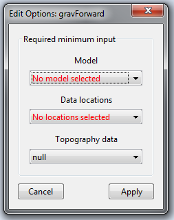

.. _fwdEditOptions_gravity:

.. include:: <isonum.txt>

Edit Options for Gravity Forward Modeling Objects
=================================================

.. _fwdEditOptions_Grav3D:

Grav3D
------

This functionality is responsible for setting all forward modeling parameters pertaining to the “gravfor3d”, "gravfor3d_51" and "gravfor3d_60" forward modeling codes; see `GRAV3D manual <http://grav3d.readthedocs.io/en/latest/>`__ . Within the edit options window, the user may set the following parameters:

    - **Model:** A relative density model. Because the model is already associated with a mesh within GIFtools, the mesh does not need to be specified here.

    - **Data locations:** Set the object which contains the observations locations.

    - **Topography (optional):** The user may define the surface topography using a *TOPOdata* object. If the surface topography is flat and set at an elevation of 0 m, the user may set to *null*.

    - **Apply:** The values and objects specified in each field are not set until the user has clicked *Apply*.

Units
^^^^^

**Inputs:**

    - **Model:** a relative density model in units :math:`g/cm^3`

**Outputs:**

    - **Predicted data:** gravity anomaly in milliGal (*mGal* )

