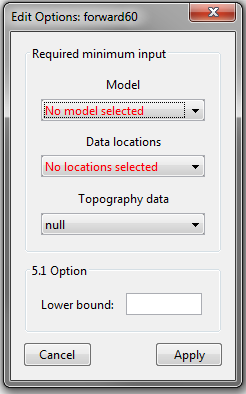
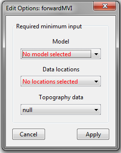

.. _fwdEditOptions_mag:

.. include:: <isonum.txt>

Edit Options for Magnetic Forward Modeling Objects
==================================================

.. _fwdEditOptions_Mag3D:

Mag3D
-----

This functionality is responsible for setting all forward modeling parameters pertaining to the “magfor3d”, "magfor3d_51" and "magfor3d_60" forward modeling codes; see `MAG3D manual <https://mag3d.readthedocs.io/en/v6/>`__ . Within the edit options window, the user may set the following parameters:

    - **Model:** A magnetic susceptibility model. Because the model is already associated with a mesh within GIFtools, the mesh does not need to be specified here.

    - **Data locations:** Set the object which contains the observations locations and background field information. If a *MAGdata* object is supplied (ver. 5.0, 5.1 and 6.0), total magnetic anomaly data are predicted. If an *AMPdata* object is supplied (ver. 6.0 only), then magnetic amplitude data are predicted.

    - **Topography (optional):** The user may define the surface topography using a *TOPOdata* object. If the surface topography is flat and set at an elevation of 0 m, the user may set to *null*.

    - **Lower bound (ver. 5.1 and 6.0):** In the case that all susceptibility values are positive, this field is best left blank as the default value is 0. In the case that you are using an effective susceptibility model, where effective susceptibility values are negative due to remanence, this parameter must be set. All cells with effective susceptibility values below the threshold value are ignored during the forward modeling; i.e. they are treated as air cells and are not used when creating the sensitivity matrix.

    - **Apply:** The values and objects specified in each field are not set until the user has clicked *Apply*.

Units
^^^^^

**Inputs:**

    - **Model:** magnetic susceptibility in SI units
    - **Lower bound:** effective susceptibility in SI units

**Outputs:**

    - **Predicted data:** total magnetic intensity and amplitude data are predicted in nanoTeslas (*nT*)

.. _fwdEditOptions_MVI:

MVI
---

This functionality is responsible for setting all forward modeling parameters pertaining to the MVI forward modeling codes. Within the edit options window, the user may set the following parameters:

    - **Model:** A magnetic vector intensity (MVI) model. Because the model is already associated with a mesh within GIFtools, the mesh does not need to be specified here.

    - **Data locations:** Set the object which contains the observations locations and background field information. The locations must be defined by a *MAGdata* object.

    - **Topography (optional):** The user may define the surface topography using a *TOPOdata* object. If the surface topography is flat and set at an elevation of 0 m, the user may set to *null*.

    - **Apply:** The values and objects specified in each field are not set until the user has clicked *Apply*.

Units
^^^^^

**Inputs:**

    - **3D effective susceptibility  model:** this model is a 3d vector model containing effective susceptibility values in SI units. The first column contains the effective susceptibility values along the direction of the inducing field. The remaining columns are effective susceptibilities along two orthogonal directions with respect to the inducing field direction.

**Outputs:**

    - **Predicted data:** total magnetic intensity and amplitude data are predicted in nanoTeslas (*nT*)

