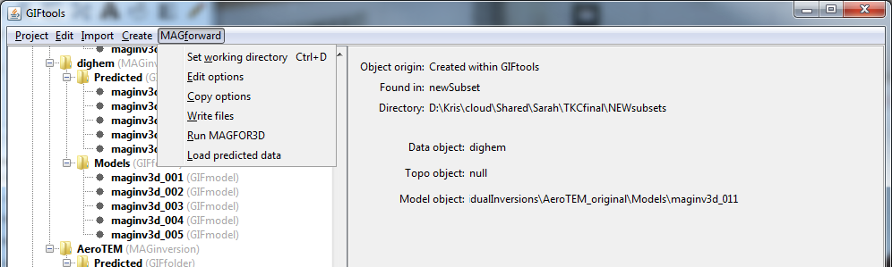

.. _fwdSetWorkDir:

.. include:: <isonum.txt>

Set the working directory
=========================

The working directory tells GIFtools where to output files (and run the forward model) associated with the selected item. It is suggested to set the directory *prior to setting any other properties* . Click on the forward modeling item, select the menu showing its class (e.g., ``E3Dforward`` or ``GRAVforward``):

**[Forward modelign class]** |rarr| **Set working directory**

**NOTE:** The shortcut for the functionality is ``control + d``.

