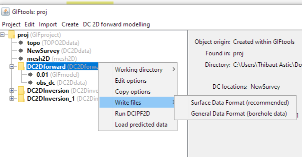

.. _fwdWriteAll:

.. include:: <isonum.txt>

Write input files to directory
==============================

Prior to running the forward model, the user must write the appropriate input files to the working directory. To write all files, regardless, click on the forward modeling item, select the menu showing its class (e.g., ``E3Dforward``):

**[Forward modeling class]** |rarr| **Write files**

.. figure:: ../../../images/simpleFwdMenu.png
    :align: center
    :width: 400

DCIP: Surface or General data format
====================================

For DCIP data object, GIFtools allow to export two types of data format for the forward modeling:
- **Surface Data Format (recommended)**: Use this data format if the electrodes are at the surface. The Z-values will be excluded from the output data file and the forward modeling code will take care of projecting them at the surface. This avoid the risk of having electrodes in the air or underground.
- **General Data Format**: Use this option if any electrode is underground. The Z-values are specified in the output data file.

**[Forward modeling class]** |rarr| **Write files**

