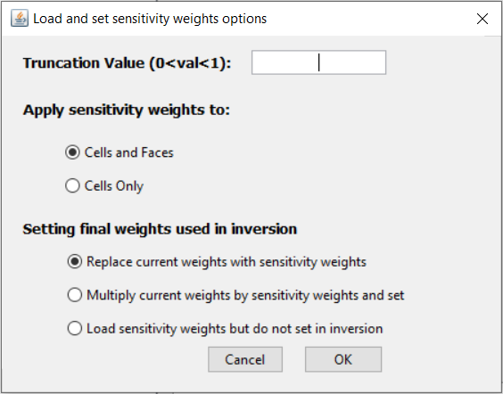

.. _inv_sens_dcip:

.. include:: <isonum.txt>

Compute and Apply Sensitivity Weights for 3D DC and IP Inversions
=================================================================

**Specifically for DC3Dinversion and IP3Dinversion objects**, we can compute and appliy sensitivity weights once completing the :ref:`edit options <invEditOptions_dcip3d>` step. A different approach is required for 2D and OcTree inversion codes.

DC3D Inversion
--------------

**Step 1:** Write the set of files that are required for computation of the sensitivities. For DC3D inversion, the sensitivities and the resulting sensitivity weights are written to the subfolder *sensitivity_weights*. To write the files for surface data or general format:

**DC3Dinversion** |rarr| **Create and apply sensitivity weights** |rarr| **Write files** |rarr| **surface format**

**DC3Dinversion** |rarr| **Create and apply sensitivity weights** |rarr| **Write files** |rarr| **general format**

|

**Step 2:** Compute sensitivities. This is done by calling the inversion code and terminating after 1 iteration. To compute the sensitivities:

**DC3Dinversion** |rarr| **Create and apply sensitivity weights** |rarr| **Compute sensitivities**

|

**Step 3:** Load output and set weights. Here, the user will select the file *sensitivity.txt* which contains the averages sensitivities.

**DC3Dinversion** |rarr| **Create and apply sensitivity weights** |rarr| **Load output and set weights**

In the pop-up window shown below, the user will see:

	- *truncation value:* The weights model will be normalized to have a maximum value of 1. So essentially, this is the minimum values in the weights model. Something like 0.001 - 0.01 is usually good.

	- *Apply sensitivity weights to cells and faces, or just cells*

	- *Setting final weights used in inversion:* The user may replace the current weights object with the sensitivity weights. The user may also multiply the current weights model by the sensitivity weights. The user may also load the weights object without altering the current inversion parameter.

IP3D Inversion
--------------

**Step 1:** Write the set of files that are required for computation of the sensitivities. For IP inversion, we can work in the main inversion directory. To write the files for surface data or general format:

**IP3Dinversion** |rarr| **Create sensitivity matrix** |rarr| **Write files for IPSEN3D** |rarr| **surface format**

**IP3Dinversion** |rarr| **Create sensitivity matrix** |rarr| **Write files for IPSEN3D** |rarr| **general format**

|

**Step 2:** Compute sensitivities. To compute the sensitivities:

**IP3Dinversion** |rarr|  **Create sensitivity matrix** |rarr| **run IPSEN3D**

|

**Step 3:** Load output and set weights. Here, the user will select the file *sensitivity.txt* which contains the averages sensitivities.

**DC3Dinversion** |rarr| **Create and apply sensitivity weights**

In the pop-up window shown below, the user will see:

	- *truncation value:* The weights model will be normalized to have a maximum value of 1. So essentially, this is the minimum values in the weights model. Something like 0.001 - 0.01 is usually good.

	- *Apply sensitivity weights to cells and faces, or just cells*

	- *Setting final weights used in inversion:* The user may replace the current weights object with the sensitivity weights. The user may also multiply the current weights model by the sensitivity weights. The user may also load the weights object without altering the current inversion parameter.

