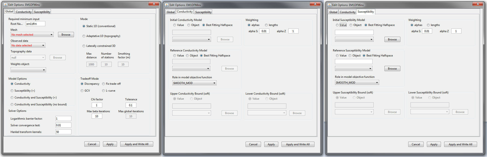
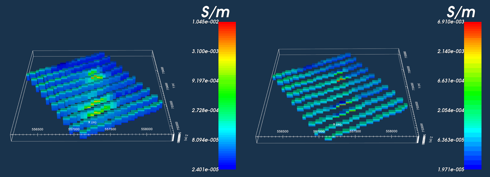

.. _invEditOptions_em1dfm:

.. include:: <isonum.txt>

Edit Options for EM1DFM Inversion Objects
=========================================

This functionality is responsible for setting all inversion parameters pertaining to the EM1DFM code. The list of parameters used to run the EM1DFM Fortran code are described in the EM1DFM package website; see `main input file <http://em1dfm.readthedocs.io/en/latest/content/files/input_em1dfm.html>`__ and `inversion methodologies <http://em1dfm.readthedocs.io/en/latest/content/theory.html#inversion-methodologies>`__. The edit options window is comprised of 3 tabs:

    - **Global:** Sets global inversion parameters such as the 1D mesh, data object, 1D inversion type, model type and computation of the trade-off parameter
    - **Conductivity:** specifies the starting model, reference model and regularization for conductivity in the inversion
    - **Susceptibility:** specifies the starting model, reference model and regularization for susceptibility in the inversion

    Global (left), conductivity (middle) and susceptibility (right) tabs for EM1DFM inversion objects.

.. _invEditOptions_em1dfm_global:

Global Tab
----------

**Required Minimum Input:** Here, the user specifies the:

    - mesh
    - observed data
    - topography (for adaptive and laterally constrained only)
    - additional model weights (optional)

**Model Options:** The user may invert for:

    - a conductivity model
    - a positive susceptibility model where a static background conductivity is used
    - conductivity and positive susceptibility models
    - conductivity and unbounded susceptibility models

**Solver Options:** Solver options set several parameters used in the EM1DFM Fortran code. The details of each parameters are discussed in the `EM1DFM manual under main input file <http://em1dfm.readthedocs.io/en/latest/content/files/input_em1dfm.html>`__

**Mode:** GIFtools is capable of carrying out three distinct 1D inversion approaches:

    - **Static:** Each transmitter is associated with a distinct sounding. The inversion independently recovers a 1D model for each sounding.
    - **Adaptive:** Here, surface topography is provided. The inversion is carried out in the same way as before, however the vertical locations of models relative to one another are set based on topography
    - **Laterally constrained:** In this approach, the data at each sounding are only sensitive to a particular 1D model. However, the set of 1D models is subject to smoothness constraints in the x and y directions. For this algorithm, three parameters must be set (these parameters are described :ref:`below <invEditOptions_em1dfm_LCI>`): 

        - **Max Distance** 
        - **Number of Stations**
        - **Smoothing Factor**

For each 1D inversion being run by the EM1DFM Fortran code, there are 4 ways in which the trade-off parameter (:math:`\beta`) can be calculated. The performance of each trade-off mode is determine by a set of parameters:

    - `Discrepancy <http://em1dfm.readthedocs.io/en/latest/content/theory.html#algorithm-2-discrepancy-principle>`__
        - **Chi Factor** and **Tolerance:** The algorithm will find the :math:`\beta` such that the data misfit :math:`\phi_d` is within :math:`N \times (C.F. \, \pm \, Tol)` where :math:`N` is the number of observations, :math:`C.F.` is the chi factor and :math:`Tol` is the tolerance. Generally a :math:`C.F.=1` and :math:`Tol=0.1` are used (static and adaptive only)
        - **Initial Chi Factor** and **Cooling Factor:** This chooses the :math:`\beta` for the first iteration according to the aforementioned method. In this case the tolerance is set automatically. For each new global iteration, :math:`\beta_i = \beta_{i-1}/C`, where :math:`C>1` is the cooling factor (laterally constrained only)
        - **Max Beta Iterations:** Maximum number of new :math:`\beta` the algorithm will compute to find best value
        - **Max Global Iterations:** Maximum number of iterations for which the laterally constrained inversion will find a new 3D model
    - `Fixed trade-off <http://em1dfm.readthedocs.io/en/latest/content/theory.html#algorithm-1-fixed-trade-off-parameter>`__
        - **Beta:** For static and adaptive 1D, the user specifies a constant value and the problem is solved using that :math:`\beta`. For laterally constrained 1D, this represents the initial :math:`\beta` value.
        - **Cooling Factor:** For each iteration, :math:`\beta_i = \beta_{i-1}/C`, where :math:`C>1` is the cooling factor
        - **Max Beta Iterations:** Maximum number of decreases in :math:`\beta` the algorithm will use to hit target misfit
        - **Max Global Iterations:** Maximum number of iterations for which the laterally constrained inversion will find a new 3D model
    - `GCV <http://em1dfm.readthedocs.io/en/latest/content/theory.html#algorithm-3-gcv-criterion>`__ (static and adaptive only)
        - **Max Beta Decrease:** Maximum allowable decrease in :math:`\beta` for estimated of :math:`\beta` using the GCV method
        - **Max Beta Iterations:** Maximum number of new :math:`\beta` the algorithm will compute to find the best value
    - `L-curve <http://em1dfm.readthedocs.io/en/latest/content/theory.html#algorithm-4-l-curve-criterion>`__ (static and adaptive only)
        - **Max Beta Decrease:** Maximum allowable decrease in :math:`\beta` for estimated of :math:`\beta` using the L-curve criterion
        - **Max Beta Iterations:** Maximum number of new :math:`\beta` the algorithm will compute to find the best value

.. _invEditOptions_em1dfm_mod:

Conductivity and Susceptibility Tabs
------------------------------------

.. _invEditOptions_em1dfm_mode:

Inversion Mode
--------------

Here, we describe approach taken by each inversion mode option.

.. _invEditOptions_em1dfm_static:

Static
^^^^^^

During the static inversion approach, 1D inversions are performed independently for each sounding according to the `EM1DFM manual <http://em1dfm.readthedocs.io/en/latest/index.html>`__. This results in one recovered model for every sounding. This approach does not consider topography and the active layers in each independent inversion are identical to those in the layer file (1D mesh) provided. The set of recovered 1D models can be plotted on a 3D mesh which is created while the inversion is running. The top of the 3D mesh is set as the elevation of the highest data observation. The surface location of each recovered model is plotted at the top of the mesh (even though the surface location and the top of the mesh might be at different elevations). 

.. _invEditOptions_em1dfm_adaptive:

Adaptive
^^^^^^^^

During the adaptive inversion approach, topography is considered by including a topography data or surface data object. Without including topography, this inversion approach is identical to the static 1D inversion. If topography is included, then the top locations of the layers used for every independently recovered 1D model correspond to the top of the 3D mesh; the top if the 3D mesh is set as the elevation of the highest data observation. For each 1D inversion, layers above the surface topography are set as air cells (inactive) and the algorithm recovers a conductivity model for the cells below. When plotted on the 3D mesh, the tops of the recovered 1D models (including air cells) correspond to the top of the 3D mesh. Thus, direct comparison of laterally variability of recovered models is possible with this approach.

.. _invEditOptions_em1dfm_LCI:

Laterally Constrained
^^^^^^^^^^^^^^^^^^^^^

**Algorithm**

- **WHILE** :math:`\phi_d >` target misfit **AND** :math:`itr <` Max Global Iterations:
    
    - **FOR** every sounding location :math:`i`:

        - Perform 1D inversion (the first :math:`\beta_i` is either set as a fixed value or determined using the discrepancy principle)

    - **FOR** every sounding location :math:`i`:

        - Find the closest :math:`N` stations within :math:`Max \; Distance` to the sounding
        - Use the inverse weighting formula to update the reference model for the sounding
        - Cool :math:`\beta_i` according to the cooling factor

.. _invEditOptions_em1dfm_mesh:

Plotting 1D Models on a 3D Mesh
-------------------------------

**Generating the Mesh:**

When survey parameters are set through **FEM sounding** |rarr| **Edit options**, a 3D mesh is generated based on the 1D mesh (layers) provided and the minimum lateral spacing between observation locations. The 3D mesh allows the user to plot the set of recovered 1D models but is not used in any of the inversion approaches. The x and y widths of cells within the 3D mesh are set based on the minimum lateral spacing between observation locations. The top of the 3D mesh corresponds with the elevation of the highest data observation location. The z widths of the cells within the 3D mesh are given directly by the 1D mesh (layers); thus if the 1D mesh has N layers, the 3D mesh will have N cells in the vertical.

    Recovered 1D models plotted on a 3D mesh without topography (left) and with (topography).

**Impact on Inversion and Plotting:**

The decision on whether or not to use topography results in two cases. **If topography is not included**, then every layer within the 1D model is active during each independent 1D inversion. Thus if the 1D mesh contains :math:`N` layers, each independently recovered 1D model will have :math:`N` conductivity and/or susceptibility values. When plotted on the 3D mesh at the corresponding horizontal location (based on observation location), all cells in the vertical direction are populated by non-zero values. However, since the top of the 3D mesh corresponds to the elevation of the highest observation location, the tops of all 1D models are also plotted at this height. As a result, data locations will appear underground when 1D models and data are plotted at the same time.

**If topography is included**, then for every independent 1D inversion, the algorithm finds all the layers that would plot below the surface topography on the 3D mesh and sets them as active. Thus if the 1D mesh contained :math:`N` layers, the number of layers that are active in any 1D inversion is :math:`N_{act} \leq N`. When plotting the set of recovered 1D models, the highest non-zero value at each sounding location will correspond to the surface topography and all cells above it will be zero. When creating a 1D mesh, the user must ultimately account for the potential decrease in the number of active cells when deciding to include topography.

