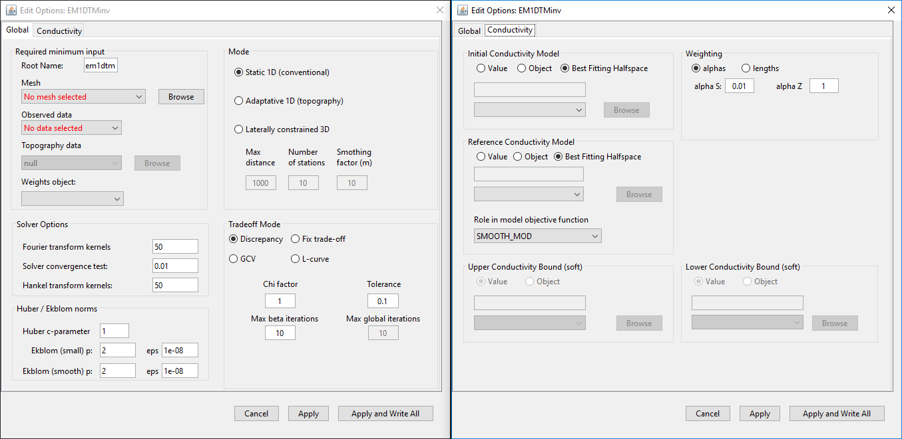

.. _invEditOptions_em1dtm:

.. include:: <isonum.txt>

Edit Options for EM1DTM Inversion Objects
=========================================

This functionality is responsible for setting all inversion parameters pertaining to the EM1DTM code. The list of parameters used to run the EM1DTM Fortran code are described in the `EM1DTM package manual <https://owncloud.eoas.ubc.ca/s/RGKKjNn5ewkzfjN/download>`__; also see `inversion methodologies <http://em1dtm.readthedocs.io/en/latest/content/theory.html#inversion-methodologies>`__. The edit options window is comprised of 3 tabs:

    - **Global:** Sets global inversion parameters such as the 1D mesh, data object, 1D inversion type, model type and computation of the trade-off parameter
    - **Conductivity:** specifies the starting model, reference model and regularization for conductivity in the inversion

    Global (left) and conductivity (middle) tabs for EM1DTM inversion objects.

.. _invEditOptions_em1dtm_global:

Global Tab
----------

**Required Minimum Input:** Here, the user specifies the:

    - mesh
    - observed data
    - topography (for adaptive and laterally constrained only)
    - additional model weights (optional)

**Model Options:** The user may invert for:

    - a conductivity model
    - a positive susceptibility model where a static background conductivity is used
    - conductivity and positive susceptibility models
    - conductivity and unbounded susceptibility models

**Solver Options:** Solver options set several parameters used in the EM1DTM Fortran code. The details of each parameters are discussed in the `EM1DTM manual  <https://owncloud.eoas.ubc.ca/s/RGKKjNn5ewkzfjN/download>`__

**Mode:** GIFtools is capable of carrying out three distinct 1D inversion approaches:

    - **Static:** Each transmitter is associated with a distinct sounding. The inversion independently recovers a 1D model for each sounding.
    - **Adaptive:** Here, surface topography is provided. The inversion is carried out in the same way as before, however the vertical locations of models relative to one another are set based on topography
    - **Laterally constrained:** In this approach, the data at each sounding are only sensitive to a particular 1D model. However, the set of 1D models is subject to smoothness constraints in the x and y directions. For this algorithm, three parameters must be set (these parameters are described in the :ref:`EM1DFM inversion modes <invEditOptions_em1dfm_LCI>`):

        - **Max Distance**
        - **Number of Stations**
        - **Smoothing Factor**

For each 1D inversion being run by the EM1DTM Fortran code, there are 4 ways in which the trade-off parameter (:math:`\beta`) can be calculated. The performance of each trade-off mode is determine by a set of parameters:

    - **Discrepancy:**
        - **Chi Factor** and **Tolerance:** The algorithm will find the :math:`\beta` such that the data misfit :math:`\phi_d` is within :math:`N \times (C.F. \, \pm \, Tol)` where :math:`N` is the number of observations, :math:`C.F.` is the chi factor and :math:`Tol` is the tolerance. Generally a :math:`C.F.=1` and :math:`Tol=0.1` are used (static and adaptive only)
        - **Initial Chi Factor** and **Cooling Factor:** This chooses the :math:`\beta` for the first iteration according to the aforementioned method. In this case the tolerance is set automatically. For each new global iteration, :math:`\beta_i = \beta_{i-1}/C`, where :math:`C>1` is the cooling factor (laterally constrained only)
        - **Max Beta Iterations:** Maximum number of new :math:`\beta` the algorithm will compute to find best value
        - **Max Global Iterations:** Maximum number of iterations for which the laterally constrained inversion will find a new 3D model
    - **Fixed trade-off:**
        - **Beta:** For static and adaptive 1D, the user specifies a constant value and the problem is solved using that :math:`\beta`. For laterally constrained 1D, this represents the initial :math:`\beta` value.
        - **Cooling Factor:** For each iteration, :math:`\beta_i = \beta_{i-1}/C`, where :math:`C>1` is the cooling factor
        - **Max Beta Iterations:** Maximum number of decreases in :math:`\beta` the algorithm will use to hit target misfit
        - **Max Global Iterations:** Maximum number of iterations for which the laterally constrained inversion will find a new 3D model
    - **GCV (static and adaptive only):**
        - **Max Beta Decrease:** Maximum allowable decrease in :math:`\beta` for estimated of :math:`\beta` using the GCV method
        - **Max Beta Iterations:** Maximum number of new :math:`\beta` the algorithm will compute to find the best value
    - **L-curve (static and adaptive only):**
        - **Max Beta Decrease:** Maximum allowable decrease in :math:`\beta` for estimated of :math:`\beta` using the L-curve criterion
        - **Max Beta Iterations:** Maximum number of new :math:`\beta` the algorithm will compute to find the best value

.. _invEditOptions_em1dtm_mod:

Conductivity and Susceptibility Tabs
------------------------------------

.. _invEditOptions_em1dtm_mode:

Inversion Mode
--------------

See the :ref:`EM1DFM inversion modes <invEditOptions_em1dfm_mode>` for more details.

