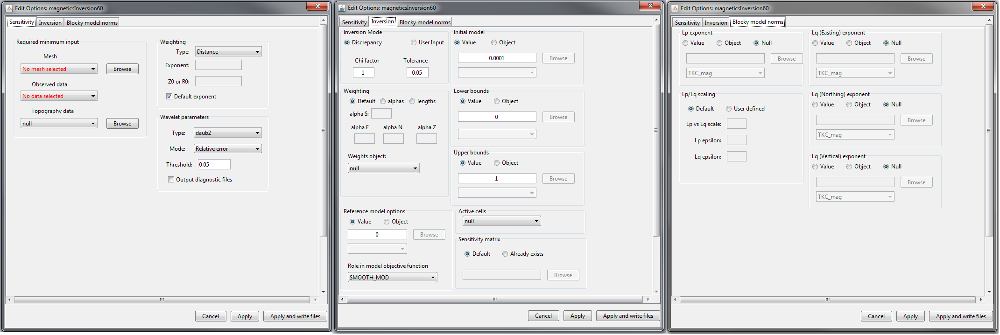
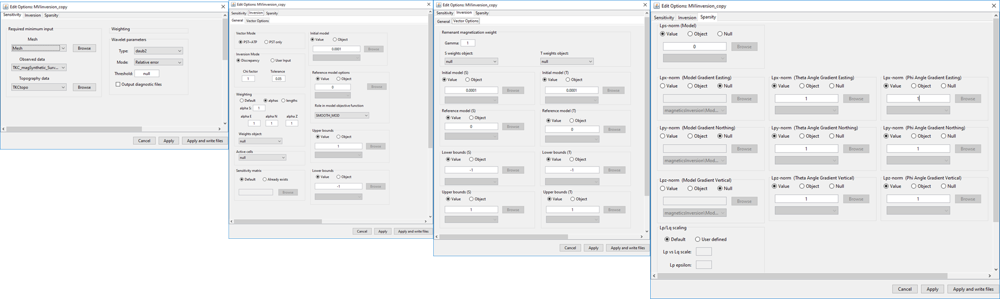

.. _invEditOptions_mag:

.. include:: <isonum.txt>

Edit Options for Magnetic Inversion Objects
===========================================

.. _invEditOptions_Mag3D:

Mag and Mag Amplitude Inversion (Mag3D)
---------------------------------------

This functionality is responsible for setting all inversion parameters pertaining to the 3D magnetic inversion codes (Mag inversion and Mag amplitude inversion); see `MAG3D background theory <https://mag3d.readthedocs.io/en/v6/content/theory.html>`__. The edit options window is comprised of 3 tabs:

    - **Sensitivity:** Sets the mesh, observed data, topography, `sensitivity weighting <https://mag3d.readthedocs.io/en/v6/content/theory.html#depth-weighting-and-distance-weighting>`__ and `wavelet compression <https://mag3d.readthedocs.io/en/v6/content/theory.html#wavelet-compression-of-sensitivity-matrix>`__
    - **Inversion:** Sets protocols for the :ref:`trade-off parameter<Fundamentals_Beta>` (:math:`\beta`) and all parameters pertaining to the model objective function (:ref:`alphas<Fundamentals_alphas>`, :ref:`cells weights<Fundamentals_WeightingMatrix>`, upper and lower bounds, active cells, reference models and starting models)
    - **Blocky model norms (ver 5.1 and above):** can be activated to recover sparse and blocky models; see :ref:`sparse and blocky norms<Fundamentals_Norms>`

    Sensitivity (left), inversion (middle) and blocky model norms (right) tabs for MAG inversion and MAG amplitude inversion objects.

.. note:: In order to update the set of inversion parameters, **you must click apply**.

Units
^^^^^

**Inputs:**

    - **Observed data:** total magnetic intensity and amplitude data are given in nanoTeslas (*nT*)
    - **Reference/background susceptibility model:** SI units

**Outputs:**

    - **Recovered susceptibility model:** SI units

Sensitivity Tab
^^^^^^^^^^^^^^^

    - **Mesh:** mesh for the recovered model

    - **Observed data:**

        - **Magnetic data:** total magnetic intensity data. Versions 5.0, 5.1 and 6.0
        - **Amplitude data:** magnetic amplitude data. Version 6.0 only

    - **Topography:** a topography data object. Leave as *null* for flat topography at an elevation of 0 m.

    - **Weighting:** set the type and parameters for sensitivity weighting. The parameters which define the sensitivity weighting are described in the `Mag3D manual <https://mag3d.readthedocs.io/en/v6/content/theory.html#depth-weighting-and-distance-weighting>`__ .

        - **Type:** Depth or distance. The choice determines the expression used for the weighting
        - **Exponent:** Given by :math:`\alpha` in the manual. This parameter has *default* = 3 to reflect the fact dipolar fields fall of as :math:`1/r^3`
        - **Z0 or R0:** These constants are defined by equations in the manual. **R0** and **Z0** are small and generally chosen to be 1/4 the length of the smallest cell dimension

    - **Wavelet parameter:** wavelet compression of the sensitivity matrix is used reduced the memory requirements for storing the sensitivity matrix and improve the speed of the inversion algorithm. The details of this are described in the `Mag3D manual <https://mag3d.readthedocs.io/en/v6/content/theory.html#wavelet-compression-of-sensitivity-matrix>`__

        - **Type:** sets the type of wavelet transform applied to the rows of the sensitivity matrix

        - **Mode:**

            - **Relative error:** the level of wavelet compression is specified by a relative threshold (*default* = 0.05)
            - **Threshold:** the level of wavelet compression is specified an absolute threshold

        - **Threshold:** user specified value based on choice in *mode*

Inversion Tab
^^^^^^^^^^^^^

    - **Inversion Mode:** Sets the protocol for the trade-off parameter (:math:`\beta` )

        - **Discrepancy:** sets the stopping criteria for the inversion using the :ref:`discrepancy principle <Fundamentals_Beta_Discrepancy>`. *Chi-factor* determines the stopping criteria and *tolerance* sets how close to the ideal stopping criteria before the inversion is terminated.
        - **User Input:** the user specifies the exact value for the trade-off parameter (*beta* )

    - **Weighting:** Sets the weights for smallness and smoothness regularization in x, y and z; for relevant equations `see manual <https://mag3d.readthedocs.io/en/v6/content/theory.html>`__ .

        - **Default:** Sets the values of *alpha S*, *alpha X*, *alpha Y* and *alpha Z* based on cell dimensions
        - **Alphas:** Sets specific values for *alpha S*, *alpha X*, *alpha Y* and *alpha Z*
        - **Lengths:** User sets values *Len E*, *Len N* and *Len Z* which define the values of *alpha X*, *alpha Y* and *alpha Z* relative to *alpha S*. These relationships are given by :math:`L_x = \sqrt{\frac{\alpha_x}{\alpha_s}}`, :math:`L_y = \sqrt{\frac{\alpha_y}{\alpha_s}}` and :math:`L_z = \sqrt{\frac{\alpha_z}{\alpha_s}}`.

    - **Weighting object:** Specify additional cell weights. Use *null* if no additional model weights are supplied.

    - **Reference model options:**

        - **Value:** use a constant value to define the reference model
        - **Object:** use a GIFmodel as the reference model

    - **Role in objective function:** the user selects *SMOOTH_MOD* or *SMOOTH_MOD_DIF*. If *SMOOTH_MOD* is selected, the reference model is included only in the smallness term in the model objective function. If *SMOOTH_MOD_DIF* is selected, the reference model is included in the smallness and smoothness terms in the model objective function. Further explanation of this is found in :ref:`fundamentals of inversion<Fundamentals_SmoothInDiff>`.

    - **Initial model:**

        - **Value:** use a constant value to define a homogeneous starting model
        - **Object:** use a GIF model as the starting model

    - **Lower bounds:**

        - **Value:** set a constant value for the lower bounds for all cells
        - **Object:** use a GIF model to supply cell-specific lower bounds

    - **Upper bounds:**

        - **Value:** set a constant value for the upper bounds for all cells
        - **Object:** use a GIF model to supply cell-specific upper bounds

    - **Active cells:** Specifies which cells lying below the surface topography are active during the inversion. All other cells remain fixed-valued (equal to starting model). Use *null* to set all cells lying below surface topography as active.

    - **Sensitivity matrix:**

        - **Default:** If this option is chosen, the code will generate the sensitivity matrix and save it to the working directory.
        - **Already exists:** If the sensitivity matrix for your problem has already been created, this option allows the user to point to the sensitivity file and avoid recomputation

Blocky Model Norms Tab (ver. 5.1 and 6.0)
^^^^^^^^^^^^^^^^^^^^^^^^^^^^^^^^^^^^^^^^^

Sparse and blocky model norms are explained in :ref:`fundamentals of inversion<Fundamentals_Norms>`. Below are parameter descriptions for fields within *edit options*.

    - **Lp exponent:**

        - **Value:** set as a constant value :math:`p \in (0,2]`
        - **Object:** use a GIF model to supply cell-specific values for :math:`p`
        - **Null:** a default value of :math:`p=2` or :math:`q=2` is used

    - **Lq exponent (Easting, Northing or Vertical):**

        - **Value:** set as a constant value :math:`p \in (0,2]` or :math:`q \in (0,2]`
        - **Object:** use a GIF model to supply cell-specific values for :math:`p` or :math:`q`
        - **Null:** a default value of :math:`p=2` or :math:`q=2` is used

    - **Lp/Lq scaling:** the nature of these parameters are discussed in :ref:`fundamentals of inversion<Fundamentals_Norms>`

        - **Lp vs Lq scale:** the user alter the weighting between smallness and smoothness while performing the sparse inversion. *Default* = 1.
        - **Lp epsilon:** see :ref:`fundamentals of inversion<Fundamentals_Norms>`
        - **Lq epsilon:** see :ref:`fundamentals of inversion<Fundamentals_Norms>`

.. _invEditOptions_MVI:

MVI Inversion
-------------

This functionality is responsible for setting all inversion parameters
pertaining to the 3D magnetic vector intensity inversion code. The edit
options window is comprised of 4 tabs:

    - **Sensitivity:** Sets the mesh, observed data, topography, `sensitivity weighting <https://mvi.readthedocs.io/en/v3/content/theory.html#sensitivity-weighting>`__ and `wavelet compression <https://mvi.readthedocs.io/en/v3/content/theory.html#wavelet-compression-of-sensitivity-matrix>`__
    - **Inversion** |rarr| **General:** Sets parameters for the magnetic susceptibility model being recovered
    - **Inversion** |rarr| **Vector Options:** Sets parameters for the magnetic remanence being recovered
    - **Sparsity**: Set the sparsity parameters for the induced and remanent components.

    (left) Sensitivity , (middle left) general inversion , (middle right) vector options  and (right) sparsity parameter  tabs for MVI inversion objects.

.. note:: In order to update the set of inversion parameters, **you must click apply**

Units
^^^^^

**Inputs:**

    - **Observed data:** total magnetic intensity data are given in nanoTeslas (*nT*)
    - **Reference/background susceptibility models for P, S or T:**  GIF model with effective susceptibility values in SI. Unlike the recovered model, only a single column values is provided.
    - **Norm model:** (Mode 2 ATP only): :ref:`Model norm file <modelNormfile>` for the cell-based sparsity parameter (unitless).

**Outputs:**

    - **Effective susceptibility model:** this model is a 3d vector model containing effective susceptibility values in SI units. The first column contains the effective susceptibility values along the direction of the inducing field. The remaining columns are effective susceptibilities along two orthogonal directions with respect to the inducing field direction.
    - **Angle model:** (Mode 2 ATP only) Two models for the vertical (theta) and horizontal (phi) angles in radian.

Sensitivity Tab
^^^^^^^^^^^^^^^

    - **Mesh:** mesh for the recovered model

    - **Observed data:** total magnetic intensity data.

    - **Topography:** a topography data object. Leave as *null* for flat topography at an elevation of 0 m.

    - **Wavelet parameter:** wavelet compression of the sensitivity matrix is used reduced the memory requirements for storing the sensitivity matrix and improve the speed of the inversion algorithm. The details of this are described in the `Mag3D manual <https://mvi.readthedocs.io/en/v3/content/programs/mviinv.html>`__

        - **Type:** sets the type of wavelet transform applied to the rows of the sensitivity matrix
        - **Mode:**
            - **Relative error:** the level of wavelet compression is specified by a relative threshold (*default* = 0.05)
            - **Threshold:** the level of wavelet compression is specified an absolute threshold
        - **Threshold:** (Default *null*) Search method (recommended), or user specified value based on choice in *mode*

Inversion (General) Tabs
^^^^^^^^^^^^^^^^^^^^^^^^

    - **Vector Mode:** Sets the coordinate system used in the inversion
        - **PST+ATP:** First run the smooth inversion in Cartesian coordinate system [PST], followed by an inversion in Spherical system [ATP]. Sparsity only available for this mode.
        - **PST:** Only run the smooth inversion in Cartesian coordinates system.

    - **Inversion Mode:** Sets the protocol for the trade-off parameter (:math:`\beta` )

        - **Discrepancy:** sets the stopping criteria for the inversion using the :ref:`discrepancy principle <Fundamentals_Beta_Discrepancy>`. *Chi-factor* determines the stopping criteria and *tolerance* sets how close to the ideal stopping criteria before the inversion is terminated.
        - **User Input:** the user specifies the exact value for the trade-off parameter (*beta*)

    - **Weighting:** Sets the weights for smallness and smoothness regularization in x, y and z; for relevant equations `see manual <https://mvi.readthedocs.io/en/v3/content/theory.html#regularization>`__ .

        - **Default:** Sets the values of *alpha S*, *alpha X*, *alpha Y* and *alpha Z* based on cell dimensions
        - **Alphas:** Sets specific values for *alpha S*, *alpha X*, *alpha Y* and *alpha Z*
        - **Lengths:** User sets values *Len E*, *Len N* and *Len Z* which define the values of *alpha X*, *alpha Y* and *alpha Z* relative to *alpha S*. These relationships are given by :math:`L_x = \sqrt{\frac{\alpha_x}{\alpha_s}}`, :math:`L_y = \sqrt{\frac{\alpha_y}{\alpha_s}}` and :math:`L_z = \sqrt{\frac{\alpha_z}{\alpha_s}}`.

    - **Weighting object:** Specify additional cell weights. Use *null* if no additional model weights are supplied.

    - **Reference model options:**
        - **Value:** use a constant value to define the reference model
        - **Object:** use a GIFmodel as the reference model

    - **Role in objective function:** the user selects *SMOOTH_MOD* or *SMOOTH_MOD_DIF*. If *SMOOTH_MOD* is selected, the reference model is included only in the smallness term in the model objective function. If *SMOOTH_MOD_DIF* is selected, the reference model is included in the smallness and smoothness terms in the model objective function. Further explanation of this is found in :ref:`fundamentals of inversion<Fundamentals_SmoothInDiff>`.

    - **Initial model:**

        - **Value:** use a constant value to define a homogeneous starting model for the principle effective susceptibility
        - **Object:** use a GIF model as the starting model

    - **Lower bounds:**

        - **Value:** set a constant value for the lower bounds for all cells
        - **Object:** use a GIF model to supply cell-specific lower bounds

    - **Upper bounds:**

        - **Value:** set a constant value for the upper bounds for all cells
        - **Object:** use a GIF model to supply cell-specific upper bounds

    - **Active cells:** Specifies which cells lying below the surface topography are active during the inversion. All other cells remain fixed-valued (equal to starting model). Use *null* to set all cells lying below surface topography as active.

    - **Sensitivity matrix:**

        - **Default:** If this option is chosen, the code will generate the sensitivity matrix and save it to the working directory.
        - **Already exists:** If the sensitivity matrix for your problem has already been created, this option allows the user to point to the sensitivity file and avoid recomputation

Inversion (Vector Options) Tab
^^^^^^^^^^^^^^^^^^^^^^^^^^^^^^

    - **Remanent magnetization weight (Gamma):** dictates the emphasis at which the inversion explains the data with effective susceptibilities parallel to the inducing field vs orthogonal. Increasing **Gamma** results in more emphasis being places on magnetization along the inducing field direction (primary component). *Defaul* = 1.

    - **Initial model (S or T):**

        - **Value:** use a constant value to define a homogeneous starting model
        - **Object:** use a GIF model as the starting model

    - **Reference model (S or T):**
        - **Value:** use a constant value to define the reference model
        - **Object:** use a GIFmodel as the reference model

    - **Lower bounds (S or T):**

        - **Value:** set a constant value for the lower bounds for all cells
        - **Object:** use a GIF model to supply cell-specific lower bounds

    - **Upper bounds (S or T):**

        - **Value:** set a constant value for the upper bounds for all cells
        - **Object:** use a GIF model to supply cell-specific upper bounds

    - **Weights (S or T):** Specify additional cell weights. Use *null* if no additional model weights are supplied.

Sparsity
^^^^^^^^

    - **Lps-norm (Model):** Norm applied to the vector amplitude either
            - **Value:** set a constant value for the approximated norm
            - **Object:** use a GIF model to supply cell-specific approximated norm
            - **Null** (Default 2)
    - **Lpx-norm (Model):** Norm applied to the gradient of vector amplitude along the x-axis (Easting) either
            - **Value:** set a constant value for the approximated norm
            - **Object:** use a GIF model to supply cell-specific approximated norm
            - **Null** (Default 2)
    - **Lpy-norm (Model):** Norm applied to the gradient of vector amplitude along the y-axis (Northing) either
            - **Value:** set a constant value for the approximated norm
            - **Object:** use a GIF model to supply cell-specific approximated norm
            - **Null** (Default 2)
    - **Lpz-norm (Model):** Norm applied to the gradient of vector amplitude along the z-axis (Vertical) either
            - **Value:** set a constant value for the approximated norm
            - **Object:** use a GIF model to supply cell-specific approximated norm
            - **Null** (Default 2)

    - **Lpx-norm (Theta):** Norm applied to the gradient of Theta angle along the x-axis (Easting) either
            - **Value:** set a constant value for the approximated norm
            - **Object:** use a GIF model to supply cell-specific approximated norm
            - **Null** (Default 2)
    - **Lpy-norm (Theta):** Norm applied to the gradient of Theta angle along the y-axis (Northing) either
            - **Value:** set a constant value for the approximated norm
            - **Object:** use a GIF model to supply cell-specific approximated norm
            - **Null** (Default 2)
    - **Lpz-norm (Theta):** Norm applied to the gradient of Theta angle along the z-axis (Vertical) either
            - **Value:** set a constant value for the approximated norm
            - **Object:** use a GIF model to supply cell-specific approximated norm
            - **Null** (Default 2)

    - **Lpx-norm (Phi):** Norm applied to the gradient of Phi angle along the x-axis (Easting) either
            - **Value:** set a constant value for the approximated norm
            - **Object:** use a GIF model to supply cell-specific approximated norm
            - **Null** (Default 2)
    - **Lpy-norm (Phi):** Norm applied to the gradient of Phi angle along the y-axis (Northing) either
            - **Value:** set a constant value for the approximated norm
            - **Object:** use a GIF model to supply cell-specific approximated norm
            - **Null** (Default 2)
    - **Lpz-norm (Phi):** Norm applied to the gradient of Phi angle along the z-axis (Vertical) either
            - **Value:** set a constant value for the approximated norm
            - **Object:** use a GIF model to supply cell-specific approximated norm
            - **Null** (Default 2)

    - **Lp/Lp scaling:** Master scaling between the model norm and gradient norm
            - **Default:** Scale=1, \\(\epsilon \\) found by cooling schedule
            - **User Defined:**
                - **Lp vs Lq scale:** Number >0, where 1 = equal penalty
                - **Lp epsilon:** Threshold value for model value (effective zero)
                - **Lq epsilon:** Threshold value for gradient values (effective zero)

