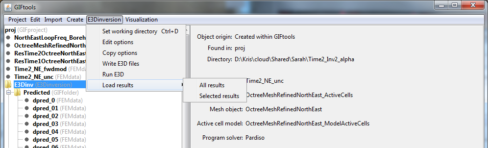

.. _invLoadResults:

.. include:: <isonum.txt>

Load inversion results and output
=================================

Once the inversion has run, the user may load either all or a selection of the predicted data and recovered models. Click on the inversion item, select the menu showing its class (e.g., ``E3Dinversion`` or ``GRAVinversion``):

- Load all results: **[Inversion class]** |rarr| **Load results** |rarr| **All results**

- Load selected results:   **[Inversion class]** |rarr| **Load results** |rarr| **Selected results**

