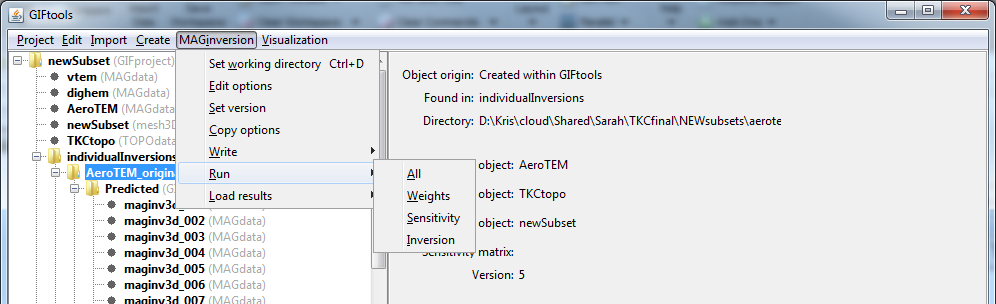

.. _invRun:

.. include:: <isonum.txt>

Run an inversion
================

Prior to running the inversion, the user must :ref:`write <invWriteAll>` the inversion files to the working directory. For inversion that require sensitivity calculations (magnetics, gravity, gravity gradiometry, IP, etc), see below. Click on the inversion item, select the menu showing its class (e.g., ``E3Dinversion``):

**[Inversion class]** |rarr| **Run [inversion name]**

.. figure:: ../../../images/simpleInvMenu.png
    :align: center
    :width: 400

Run an inversion with a sensitivity prerequisite
^^^^^^^^^^^^^^^^^^^^^^^^^^^^^^^^^^^^^^^^^^^^^^^^

For those inversions that require sensitivity matrices (and weighting), there are two ways of running the inversion. The first (and easiest) is use the **Run** |rarr| **All** menu. GIFtools will create a batch file and run all the necessary executables.

**NOTE 1:** In the case of simply changing standard deviations, the sensitivity (and weighting) does not need re-ran. Instead, the user can use the **Run** |rarr| **[inversion name]** menu as shown above. Do not forget that files need be written to disk if any changes have been updated.

**NOTE 2:** GIFtools gives the user the ability to run only the sensitivity and weighting if desired (see above figure). In those cases, the name of the input file will be required (and thus the write statement should have been used).

Run a DCIP inversion with a sensitivity-weighting
^^^^^^^^^^^^^^^^^^^^^^^^^^^^^^^^^^^^^^^^^^^^^^^^^

For ``DCINV2D`` and ``DCINV3D``, there is an option to use sensitivity-weighting. If this option is chosen, the program will be called a first time to compute the sensitivity matrix. GIFtools will then automatically load the sensitivity, compute the weights and launch the full inversion.
