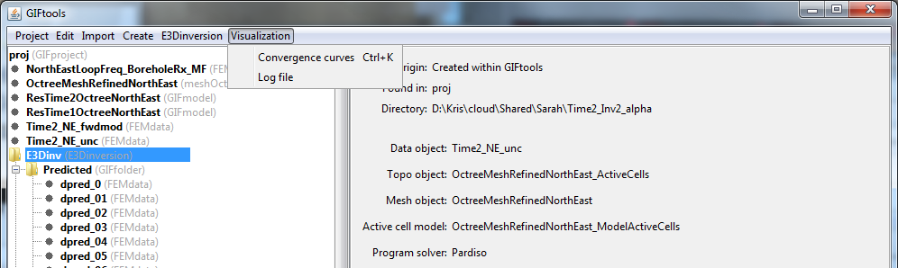

.. _invView:

.. include:: <isonum.txt>

View inversion results
======================

GIFtools allows the user two different ways to view the output of the inversion. The methods are grouped under **Visualization** menu when clicking on the inversion item.

.. _convergence_curve:

Convergence curves
^^^^^^^^^^^^^^^^^^

To view the convergence curves, click on the inversion item and the use the menu:

**Visualization** |rarr| **Convergence curves**

The shortcut for this viewer is ``control + k`` for any inversion item selected in the tree.

Log file
^^^^^^^^

To view the log file of the inversion, click on the item and use the menu:

**Visualization** |rarr| **Log file**

