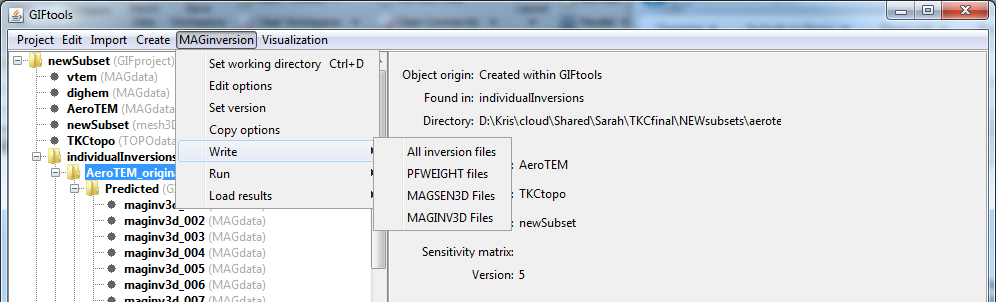

.. _invWriteAll:

.. include:: <isonum.txt>

Write inversion files to directory
==================================

Prior to running the inversion, the user must write the appropriate inversion files to the working directory. For inversion that require sensitivity calculations (magnetics, gravity, gravity gradiometry, IP, etc), see below. To write all files, regardless, click on the inversion item, select the menu showing its class (e.g., ``E3Dinversion``):

**[Inversion class]** |rarr| **Write [inversion name] files**

.. figure:: ../../../images/simpleInvMenu.png
    :align: center
    :width: 400

Write inversion files with a sensitivity prerequisite
^^^^^^^^^^^^^^^^^^^^^^^^^^^^^^^^^^^^^^^^^^^^^^^^^^^^^

For those inversions that require sensitivity matrices (and weighting), using the **Write** **All inversion files** will work. The user has the ability to micro-manage the inversion and the same menu will also allow the user to write the sensitivity or weighting files to disk:

**NOTE:** Writing all inversion files will automatically write the sensitivity (and weighting) files for the user.

