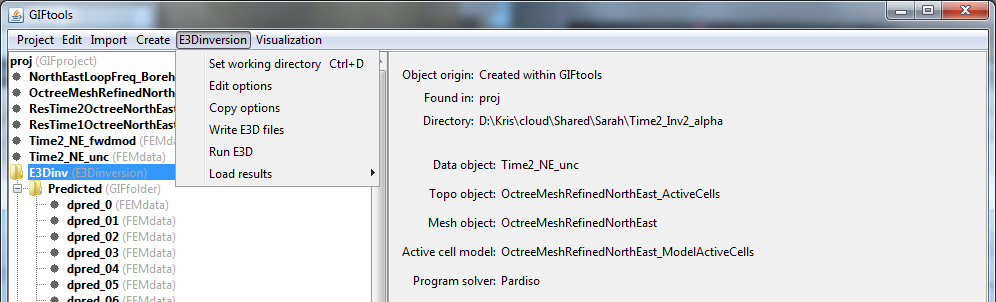

.. _invWriteAll:

.. include:: <isonum.txt>

Write inversion files to directory
==================================

General
-------

Prior to running the inversion, the user must write the appropriate inversion files to the working directory. For inversion that require sensitivity calculations (magnetics, gravity, gravity gradiometry, IP, etc), see below. To write all files, regardless, click on the inversion item, select the menu showing its class (e.g., ``E3Dinversion``):

**[Inversion class]** |rarr| **Write [inversion name] files**

DCIP: Surface or General data format
------------------------------------

For DCIP data object, GIFtools allow to export two types of data format for the inversion:
- **Surface Data Format (recommended)**: Use this data format if the electrodes are at the surface. The Z-values will be excluded from the output data file and the inversion code will take care of projecting them at the surface. This avoid the risk of having electrodes in the air or underground.
- **General Data Format**: Use this option if any electrode is underground. The Z-values are specified in the output data file.

**[Forward modeling class]** |rarr| **Write files**

.. figure:: ../../../images/dcipForwardModelingWriteFiles.png
    :align: center
    :width: 400