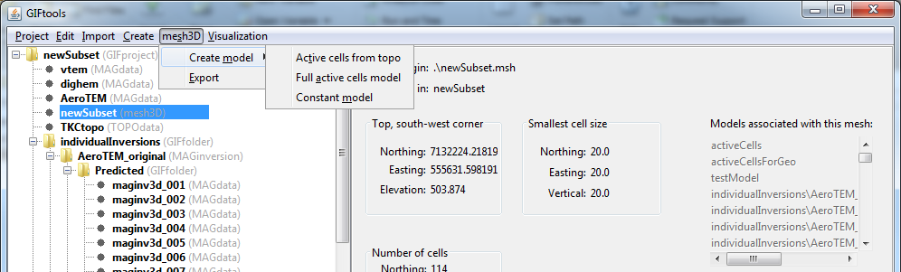

.. _createActiveCellsModel:

.. include:: <isonum.txt>

Create an active cells model
============================

There are two active cell models that can be created from a mesh:

#. Active cells from topography (GIF topography object required): select mesh and the **class menu** (e.g., mesh3D) |rarr| **Create model** |rarr| **Active cells from topo**

#. Model of all active cells: select mesh and the **class menu** (e.g., mesh3D) |rarr| **Create model** |rarr| **Full active cells model**

