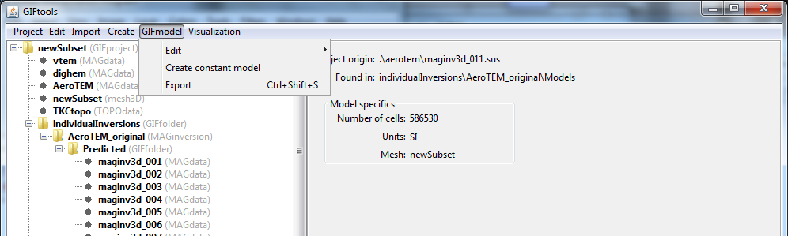

.. _createConstantModel:

.. include:: <isonum.txt>

Create a constant model
=======================

There are two ways to create a constant model object:

- From a mesh: select mesh and the **class menu** (e.g., mesh3D) |rarr| **Create model** |rarr| **Constant model**

.. figure:: ../../../images/meshCreateModel.png
    :align: center
    :width: 400

- From a model: select model and the menu **GIFmodel** |rarr| **Create constant model**

