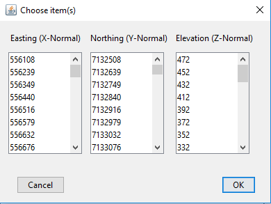
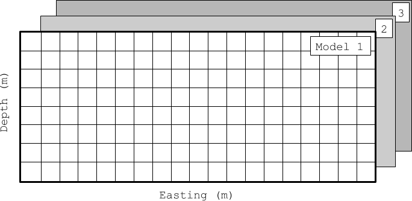

.. _objectMeshExtractSections:

.. include:: <isonum.txt>

Extract Model Section
=====================

This tool allows the user to extract sections from multiple 3D models.

**Mesh** |rarr| **Extract Sections**

The function returns a ``GIFfolder`` with mesh and model corresponding to the
chosen sections. The sections are stored on a 2.5D mesh made up of 1 m thick
layers.

