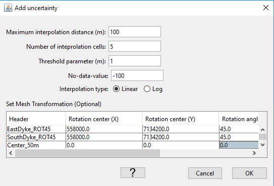
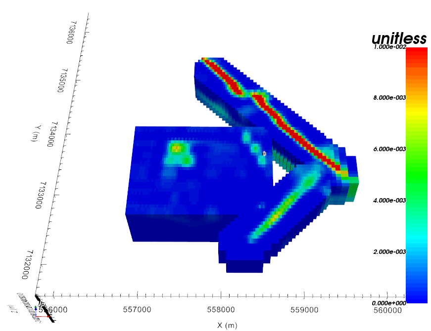

.. _objectMeshMerge3DModels:

.. include:: <isonum.txt>

Merge (Interpolate) 3D models
=============================

This tool allows the user to merge multiple 3D models onto a given mesh. The
operation can be done across meshes with different discretization. The main
menu allows the user to specify simple grid transformations as well as
interpolation parameters:

The following fields control the inverse distance interpolation:

.. math::
    \mathbf{\bar m} = \frac{\sum_{i=1}^{N} \mathbf{m_i}{r_i}}{\sum_{i=1}^{N} {r_i}}

.. math::
    {r_i} = \left[ (x(\bar m) - x(m_i))^{2} + (y(\bar m) - y(m_i))^{2} + \delta \right]^{1/2}

where *x* and *y* define the cell center location of model column **m** in the underlying mesh.

+--------------------------------+-------------------------------------------------------+
| Options                        |  Description                                          |
+--------------------------------+-------------------------------------------------------+
| Maximum Interpolation Distance | Neighboring cells with active property values         |
+--------------------------------+-------------------------------------------------------+
| N. Interpolation Points        | Number of neighbors included in the weighted average  |
+--------------------------------+-------------------------------------------------------+
| Threshold parameters           | Smoothing factor                                      |
+--------------------------------+-------------------------------------------------------+
| No-data-value                  | Fill values for air cells and empty model             |
+--------------------------------+-------------------------------------------------------+
| Rotation center [X,Y]          | Easting, Northing position of rotation center         |
+--------------------------------+-------------------------------------------------------+
| Rotation angle                 | Rotation counter-clockwise from East                  |
+--------------------------------+-------------------------------------------------------+
| Translation [X,Y]              | Grid translation distances                            |
+--------------------------------+-------------------------------------------------------+

.. example::    - `Download this example <https://github.com/ubcgif/GIFtoolsCookbook/raw/master/assets/example_ModelMerge.zip>`_

