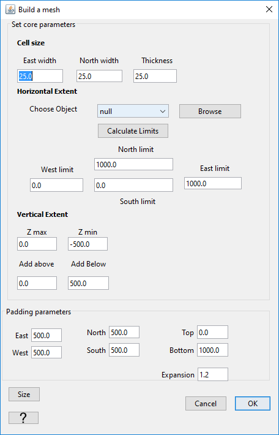

.. _objectMeshAddPadding:

.. include:: <isonum.txt>

Modifying a Tensor mesh
=======================

GIFtools allows you to modify your Tensor mesh based on parameters that are auto-detected by ``GIFtools`` or that have been previously
stored on the ``GIFmesh`` object. ``GIFtools`` will
prompt a :ref:`Mesh Creation <create_mesh>` panel with parameters auto-filled
for either a ``mesh1D``, ``mesh2D`` or ``mesh3D``. See the corresponding documentation for more details.

    :ref:`Mesh modification options <create_mesh>`
