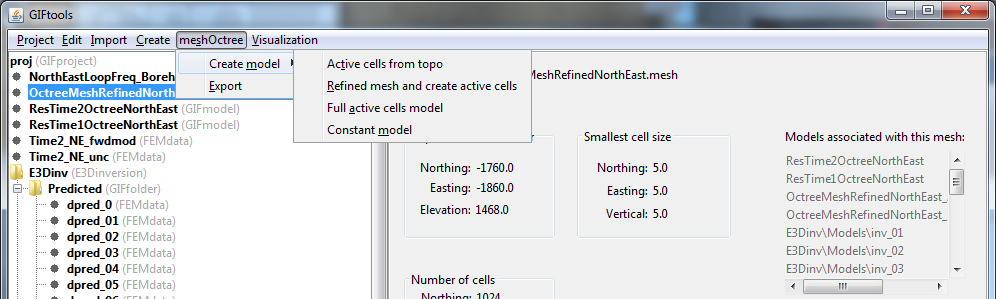

.. _refineOctree:

.. include:: <isonum.txt>

Refine an ocTree mesh from topography
=====================================

In cases where small cells can be too prohibitive in the presence of topography, the user can create an octree mesh with the original cell size in the core region, but with a refined cell size within the mesh in the areas where topography undulations occur. To refine the ocTree mesh, select the mesh and then the menus:

**meshOctree** |rarr| **Create model** |rarr| **Refined mesh and create active cells**

**NOTE:** This will create a new ocTree mesh and an active cells model. 

