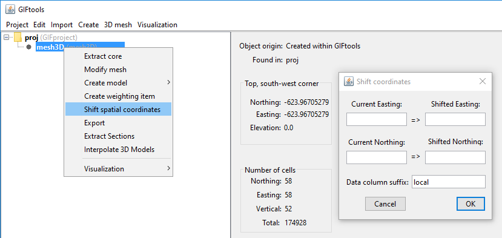

.. _objectMeshShiftCoordinates:

.. include:: <isonum.txt>

Shift Mesh Coordinates
======================

This tool allows you to translate the coordinates of a mesh using the
``current`` and ``shifted`` Easting and Northing coordinates.

