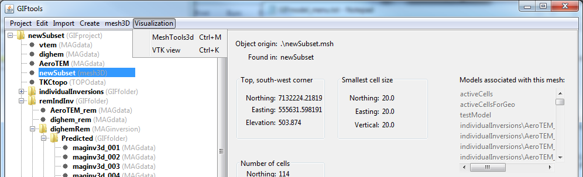

.. _viewMesh:

.. include:: <isonum.txt>

View a mesh
===========

GIFtools allows the user two different ways to view a mesh. The methods are grouped under **Visualization** menu when clicking on the mesh item.

MeshTools3D
^^^^^^^^^^^

To view the model in meshTools3D, click on the data item and the use the menu:

**Visualization** |rarr| **MeshTools3D**

The shortcut for this viewer is ``control + m`` for any item selected in the tree. 

**NOTE:** ``MeshTools3D.exe`` must be pathed or located in the parental directory of GIFtools for this function to work.

VTK data viewer
^^^^^^^^^^^^^^^

3D visualization is performed through the VTK (Visualization ToolKit) model viewer. Click on the model item and use the menu:

**Visualization** |rarr| **VTK view**

The shortcut for this viewer is ``control + k`` for any item selected in the tree.
 

