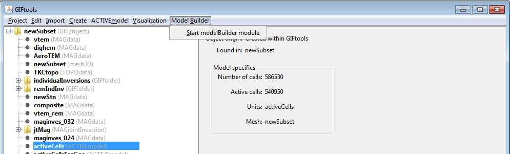

.. _objectFunctionalityActiveModel:

.. include:: <isonum.txt>

Active Cells Models
===================

.. _objectFunctionalityActiveGeoModel:

Create Constant Geological Model
--------------------------------

This feature allows the user to create a geology model where all active cells (below topography) and inactive cells (air cells) can be assigned constant physical property values. Once created, the user is responsible for setting the physical property values for the active and inactive cells; see :ref:`geology models <objectFunctionalityGeoModel>`. This functionality is accessed through:

**Active-cell model** |rarr| **Create model** |rarr| Constant geology model

.. _objectFunctionalityActiveMB:

Create a Model Builder Module
=============================

The Model Builder module allows the user to create reference models, weights, and bounds constraints for inversion from geology and other physical property measurements. If the GIF project contains an :ref:`active cells model<modelfile>`, the user may create a Model Builder model by:

**Select active cells model** |rarr| **Model Builder** |rarr| **Start modelBuilder module**

