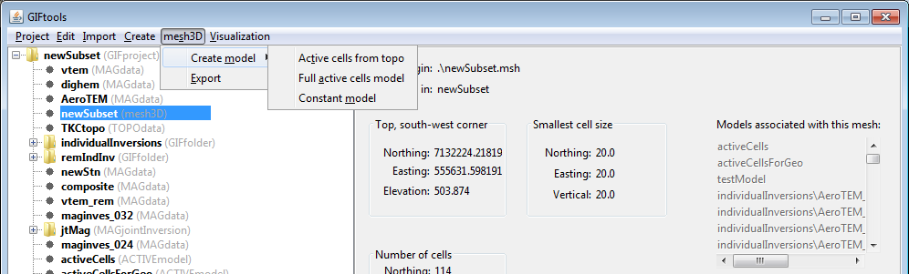
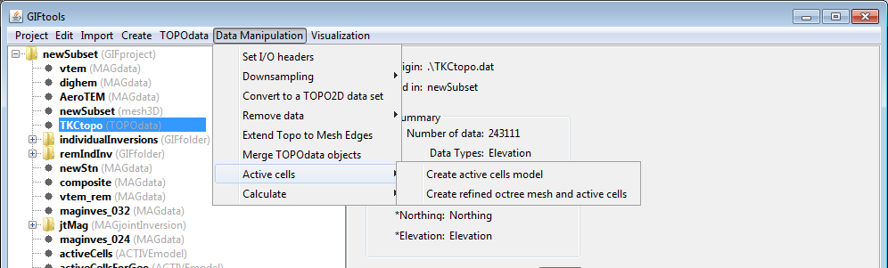

.. _createActiveCells:

.. include:: <isonum.txt>

Create an active cells model
============================

Typically, active cell models are created to define topography and/or active/inactive regions of the model for an inversion. Active cell models only only contain values of 0 (inactive), 1 (active), or -1 (active with influence on the inversion). There are two ways to create an active cell model:

Select the GIFmodel object then the menu

- From a mesh (for topography): **[mesh class]** |rarr| **Create model** |rarr| **Active cells from topo** 
- From a mesh (all active): **[mesh class]** |rarr| **Create model** |rarr| **Full active cells model** 

- From a topography item: **TOPOdata** |rarr| **Data manipulation** |rarr| **Active cells** |rarr| **Create active cells model**

 

Prerequisites
-------------

A mesh and a topography item (unless creating a full active cells model where every cell is active)

