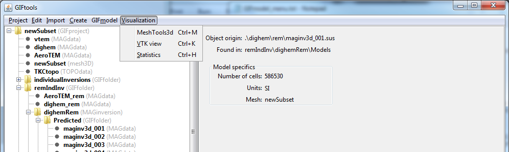
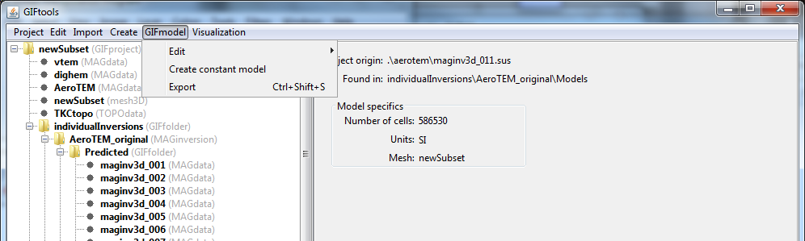

.. _objectFunctionalityGeneralModel:

.. include:: <isonum.txt>

General Functionality
=====================

.. _objectModelView:

Viewing a model
^^^^^^^^^^^^^^^

GIFtools allows the user three different ways to view models. The methods are grouped under **Visualization** menu when clicking on the model item.

MeshTools3D
-----------

To view the model in meshTools3D, click on the data item and the use the menu:

**Visualization** |rarr| **MeshTools3D**

The shortcut for this viewer is ``control + m`` for any item selected in the tree.

**NOTE:** ``MeshTools3D.exe`` must be pathed or located in the parental directory of GIFtools for this function to work.

VTK data viewer
---------------

3D visualization is performed through the VTK (Visualization ToolKit) model viewer. Click on the model item and use the menu:

**Visualization** |rarr| **VTK view**

The shortcut for this viewer is ``control + k`` for any item selected in the tree.

Statistics viewer
-----------------

GIFtools offers a histogram view with minor statistics for the model. To access the histogram viewer, click on the data item and the use the menu:

**Visualization** |rarr| **Statistics**

The shortcut for this viewer is ``control + h`` for any item selected in the tree.

.. _exportModel:

Export a Model
^^^^^^^^^^^^^^

GIFtools will allow the user to export any model object at any time through either:

    - **Active-cell model** |rarr| **Export**
    - **Geology Model** |rarr| **Export**
    - **GIF Model** |rarr| **Export**

**NOTE** Exporting of the model will *not* export its associated mesh (see :ref:`Exporting meshes <exportMesh>`)!
