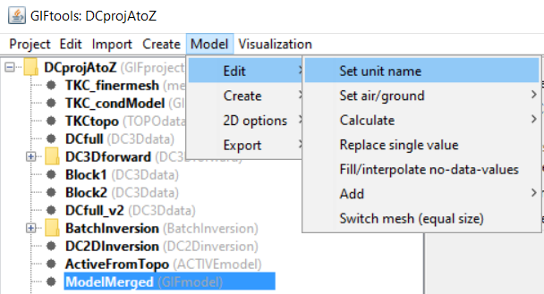

.. _objectFunctionalityGifModel:

.. include:: <isonum.txt>

Functionality for GIF Models
============================

.. _objectFunctionalityUnitName:

Set Unit Name for the Model
^^^^^^^^^^^^^^^^^^^^^^^^^^^

To set the model unit name, select the GIFmodel object then the menu:

**GIFmodel** |rarr| **Edit** |rarr| **Set unit name**

**NOTE** This will *not* change the values of the units (use the :ref:`simple calculator<objectFunctionalityMathSimple>` to change units)! Simply the unit name.

.. _objectModelAssignAirCells:

Set Air/Ground Cells in Models
^^^^^^^^^^^^^^^^^^^^^^^^^^^^^^

There are two ways to assign aircell values to a physical property model.

OPTION 1: From active model
---------------------------

For **GEO models** and **GIF models**, the physical property values for the air cells can be manual set through either:

    - **GIF Model** |rarr| **Edit** |rarr| **Assign value to air cells**
    - **Geology Model** |rarr| **Change values** |rarr| **Assign value to air cells**

.. note:: **Prequisites**: An active cell model associated with the model's mesh.

.. _objectModelFillUpwardCutAirCells:

OPTION 2: Fill values upward and cut with topography
----------------------------------------------------

TThis function allows the user to re-define the air/ground interface. First,
model values from the top ground cells (from no-data-value) are copied
vertically. Secondly, air cells are assigned based on a topography or active model objects.

.. _objectFunctionalityMathSimple:

Perform Simple Mathematical Operations on Model Values
^^^^^^^^^^^^^^^^^^^^^^^^^^^^^^^^^^^^^^^^^^^^^^^^^^^^^^

To perform a simple mathematical operation (i.e., change units), select the GIFmodel object then the menu:

**GIFmodel** |rarr| **Edit** |rarr| **Calculate** |rarr| **Simple calculator**

.. _objectFunctionalityMathModel:

Perform Mathematical Operations Involving Another Model
^^^^^^^^^^^^^^^^^^^^^^^^^^^^^^^^^^^^^^^^^^^^^^^^^^^^^^^

To perform a mathematic operations involving another model (i.e., sum the values), select the GIFmodel object then the menu:

**GIFmodel** |rarr| **Edit** |rarr| **Calculate** |rarr| **Model calculator**

.. _objectFunctionalityModReplaceValue:

Replace Value
^^^^^^^^^^^^^

This functionality allows the user to change the physical property value of cells within a GIF model based on their current value. This functionality is accessed through:

**GIFmodel** |rarr| **Edit** |rarr| **Replace value**

The following fields are then filled in:

	- **Old value:** approximate value for cells whose physical property will be replaced
	- **New value:** new physical property value for cells being replaced
	- **Tolerance:** The extent at which physical property values may differ from *old value* and be replace by *new value*

.. _objectFunctionalityFillNDValue:

Fill No-Data-Values (2D Interpolation)
^^^^^^^^^^^^^^^^^^^^^^^^^^^^^^^^^^^^^^

This functionality allows the user to interpolate the physical property values
between columns of models. The algorithm first copy ground values upward, then
proceed with and inverse distance interpolation between columns of model values.

The following fields control the inverse distance interpolation:

.. math::
    \mathbf{\bar m} = \frac{\sum_{i=1}^{N} \mathbf{m_i}{r_i}}{\sum_{i=1}^{N} {r_i}}

.. math::
    {r_i} = \left[ (x(\bar m) - x(m_i))^{2} + (y(\bar m) - y(m_i))^{2} + \delta \right]^{1/2}

where *x* and *y* define the cell center location of model column **m** in the underlying mesh.

- **Number of interpolation cells (N):** Number of neighboring cells to use in the 2D inverse distance (1=NearestNeighbor)
- **Threshold parameter** (:math:`\delta`): Smoothing parameter controlling thresholding the inverse distances
- **North-South Stretching Factor:** Value controlling the stretching of the interpolation along the North-South direction. Increase this value to compensate for East-West oriented models.
- **East-West Stretching Factor:** Value controlling the stretching of the interpolation along the North-South direction. Increase this value to compensate for North-South oriented models.
- **No-data-value**: Value used in the search of empty model columns and air cells for the upward fill
- **Interpolation type**: Perform the weighted averaging in linear or logarithmic space

+---------------------------------------------------------------+------------------------------------------------------------------+
|.. figure:: ../../../images/AtoZ_DCIP/AtoZ_DC_inv2D.png        |   .. figure:: ../../../images/AtoZ_DCIP/AtoZ_DC_inv2DInterp.png  |
|    :align: center                                             |       :align: center                                             |
|    :figwidth: 75%                                             |       :figwidth: 75%                                             |
|                                                               |                                                                  |
+---------------------------------------------------------------+------------------------------------------------------------------+

.. _objectFunctionalityNearest3D:

Nearest Neighbour (3D Interpolation)
^^^^^^^^^^^^^^^^^^^^^^^^^^^^^^^^^^^^

This funcationality will apply nearest neighbour to interpolate the model from one 3D or OcTree mesh to another 3D or OcTree mesh. This functionality is accessed through:

**Model** |rarr| **3D options** |rarr| **Nearest neighbour interpolation**

.. figure:: ../../../images/modelNearestInterp.png
    :align: center
    :width: 400

Important parameters for the interpolation and management of cells in the padding are as follows:

    - **Air value:** The value given to all cells lying outside the active topography

    - **Padding Cell Options:**

        - *Nearest neighbour:* All cells within the active topography will be determined via nearest neighbour interpolation
        - *Set padding to constant:* All active topography cells in the padding will be assigned a constant value
        - *Decay to constant:* Cells in the padding will decay towards a background value according to the following expression

.. math::
    m_0 + (m_i - m_0)\, \eta^q \;\;\; \textrm{where} \;\;\; q = 1 - \bigg ( \frac{V}{V_{min}} \bigg )^{1/3}

where :math:`m_0` is the background value, :math:`m_i` is the value if nearest neighbour was applied, :math:`0 < \eta < 1` and :math:`V` is the volume. For OcTree meshes, :math:`\eta \in` [0.8, 0.9] works well. For tensor models, :math:`\eta \sim` 0.5 works well.

.. figure:: ../../../images/modelNearestInterp_examples.png
    :align: center
    :width: 400

    Examples of different padding choices when input model is only defined in the core mesh region. Nearest neighbour (left). Constant (middle). Decay to constant (right).

.. _objectFunctionalityAddPolyhedra:

Add Rectangular Block and Polyhedra-Based Structures
^^^^^^^^^^^^^^^^^^^^^^^^^^^^^^^^^^^^^^^^^^^^^^^^^^^^

The property data locations or locations based on data values may be used. Either convex or non-convex polyhedra may be calculated. Select the GIFmodel object then the menu:

- Block: **GIFmodel** |rarr| **Edit** |rarr| **Add** |rarr| **Rectangular Block**

- Convex: **GIFmodel** |rarr| **Edit** |rarr| **Add** |rarr| **convex polyhedron from PROPdata**

- Non-convex: **GIFmodel** |rarr| **Edit** |rarr| **Add** |rarr| **non-convex polyhedron from PROPdata**

**Prerequisites**

A property data (PROPdata) item must be ref:`imported <importProp>`.

.. _objectModelSwitchMesh:

Switch Mesh (of equal size)
^^^^^^^^^^^^^^^^^^^^^^^^^^^

.. _objectFunctionalityModCreateActive:

Create Active Model
-------------------

This functionality will examine the cell values in a *GIFmodel* and create and *ACTIVEmodel* object. The *ACTIVEmodel* keeps track of which cells like below the surface topography. This functionality is accessed through:

**GIFmodel** |rarr| **Create** |rarr| **Active model**

So long as the size of the mesh is the same, the associated mesh for any model can be changed through either:

    - **Active-cell model** |rarr| **Switch mesh**
    - **Geology Model** |rarr| **Switch mesh**
    - **GIF Model** |rarr| **Edit** |rarr| **Switch mesh**
