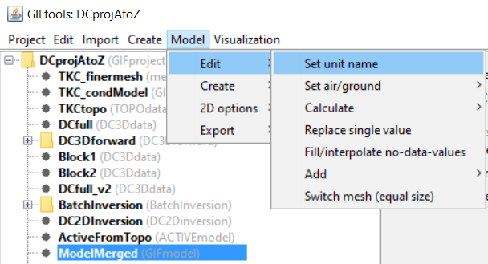

.. _modelCalculator:

.. include:: <isonum.txt>

Perform a simple mathematical operation to a model
==================================================

To perform a simple mathematical operation (i.e., change units), select the GIFmodel object then the menu:

**GIFmodel** |rarr| **Edit** |rarr| **Simple calculator** 

