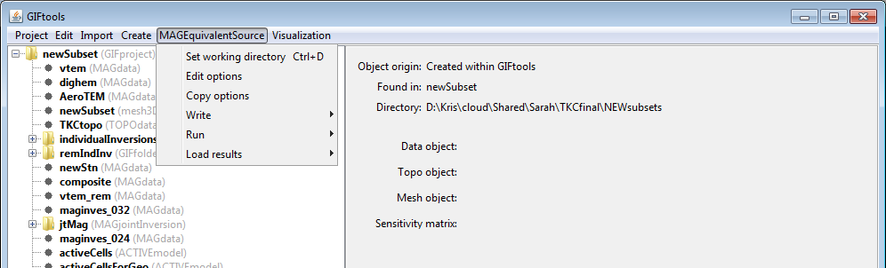

.. _esrcEditOptions:

.. include:: <isonum.txt>

Edit the equivalent-source's options
====================================

To change the options of the equivalent source, such as the mesh, data item, topography, or bounds, click on the equivalent source item, select the menu showing its class (e.g., ``MAGEquivalent source`` or ``GRAVEquivalent source``):

**[Equivalent source class]** |rarr| **Edit options**

