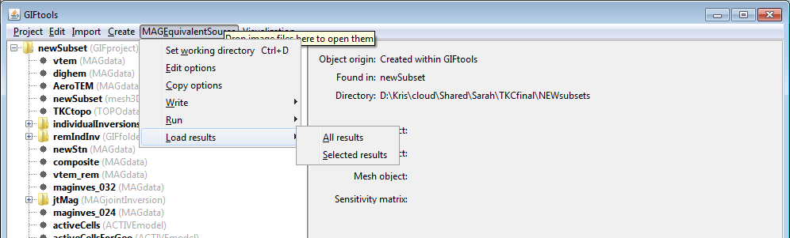

.. _esrcLoadResults:

.. include:: <isonum.txt>

Load equivalent-source output
=============================

Once the equivalent source has run, the user may load either all or a selection of the predicted data and recovered models. It is recommended that only the last iteration (that has been performed with the full sensitivity matrix) be loaded. Click on the equivalent-source item, select the menu showing its class (e.g., ``MAGEquivalent source`` or ``GRAVEquivalent source``):

- Load all results: **[Equivalent-source class]** |rarr| **Load results** |rarr| **All results**

- Load selected results:   **[Equivalent-source class]** |rarr| **Load results** |rarr| **Selected results**

