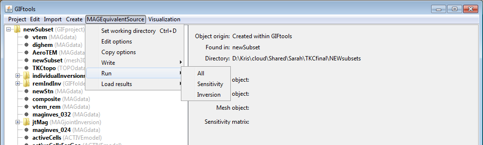

.. _esrcRun:

.. include:: <isonum.txt>

Run the equivalent-source program
=================================

Prior to running the equivalent-source program, the user must :ref:`write <esrcWriteAll>` the files to the working directory. There are two ways of running the equivalent source. The first (and easiest) is use the **Run** |rarr| **All** menu. GIFtools will create a batch file and run all the necessary executables. The second is to run the sensitivity and "inversion" separately. For the first: click on the equivalent-source item, select the menu showing its class (e.g., ``MAGEquivalentSource``):

**[Equivalent-source class]** |rarr| **Run** |rarr| **All**

**NOTE 1:** In the case of simply changing standard deviations, the sensitivity (and weighting) does not need re-ran. Instead, the user can use the **Run** |rarr| **[equivalent-source name]** menu as shown above. Do not forget that files need be written to disk if any changes have been updated.

**NOTE 2:** GIFtools gives the user the ability to run only the sensitivity if desired (see above figure). In those cases, the name of the input file will be required (and thus the write statement should have been used).

**NOTE 3:** In the case of equivalent source processing, the data are the final product rather than the recovered model. Therefore, we recommend running the code with the full sensitivity matrix at the end in order to remove any distortions caused by the wavelet compression.

