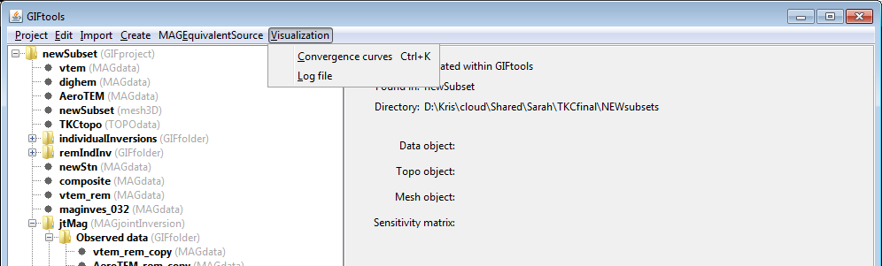

.. _esrcView:

.. include:: <isonum.txt>

View equivalent-source results
==============================

GIFtools allows the user two different ways to view the output of the equivalent source. The methods are grouped under **Visualization** menu when clicking on the equivalent-source item.

Convergence curves
^^^^^^^^^^^^^^^^^^

To view the convergence curves, click on the equivalent-source item and the use the menu:

**Visualization** |rarr| **Convergence curves**

The shortcut for this viewer is ``control + k`` for any equivalent-source item selected in the tree.

Log file
^^^^^^^^

To view the log file of the equivalent source, click on the item and use the menu:

**Visualization** |rarr| **Log file**

