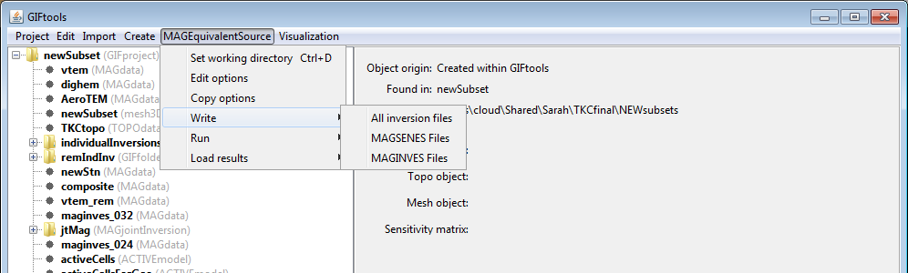

.. _esrcWriteAll:

.. include:: <isonum.txt>

Write equivalent-source files to directory
==========================================

Prior to running the equivalent-source program, the user must write the appropriate files to the working directory. To write all files click on the equivalent-source item, select the menu showing its class (e.g., ``MAGequivalent source``):

**[Equivalent-source class]** |rarr| **Write All**

For those who would like to micro-manage the equivalent-source program, the sensitivity and inversion file may be written in separate steps using the **Write** |rarr| **[Equivalent-source sensitivity name]** or **Write** |rarr| **[Equivalent-source inversion name]**, respectfully.

**NOTE:** The *Write all* command will automatically also write the sensitivity files for the user.

