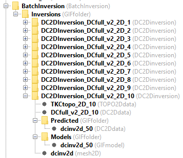
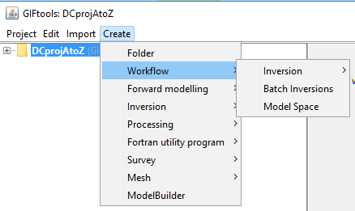
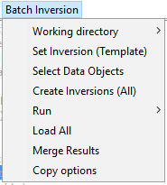
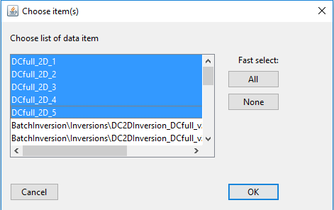
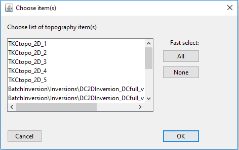

.. _objectFunctionalityWorkflowBatchInversion:

.. include:: <isonum.txt>

Batch Inversion
===============

With a ``BatchInversion`` object, the user can schedule to run several
independent inversions (data, topography, mesh) but with common inversion
parameters. This ``Workflow`` was primarily designed to reduce the processing
time of DCIP2D data. Inversion objects are created and stored under
a common folder structure. Recovered models can be merged for viewing in 3D.

.. _batchInversionCreate:

Create Batch Inversion
^^^^^^^^^^^^^^^^^^^^^^

``Batch Inversion`` object can be created through the ``Project`` menu structure:

**Create** |rarr| **Workflow** |rarr| **Batch Inversion**

A ``BatchInversion`` folder will be created in your project directory. The
following sections cover the different options available under the ``Batch
Inversion`` menu structure.

.. _batchInversionSetTemplate:

Set Inversion (Template)
^^^^^^^^^^^^^^^^^^^^^^^^

This option will prompt a menu for the selection of an ``Inversion`` object
used as a template for all subsequent inversions. General inversion options,
such as :math:`\alpha`-values, reference and starting models can be set on
this object.

**Workflow** |rarr| **Set Template**

.. figure:: ../../../images/Workflows/batchInversion_setTemplate.png
    :align: center
    :figwidth: 40%

.. _batchInversionSetData:

Select Data Objects
^^^^^^^^^^^^^^^^^^^

This option will prompt a menu for the selection of ``Data`` objects, for
which an ``Inversion`` object will be created.

**Workflow** |rarr| **Select Data Objects**

**[OPTIONAL]**: For DCIP2D inversions, a second menu for the selection of ``TOPO2Ddata`` objects will follow:

If none are selected, the ``Batch Inversion`` will default to the input topography of the ``Template``.

.. _batchInversionCreateInv:

Create/Write Inversions
^^^^^^^^^^^^^^^^^^^^^^^

With this option, the ``Batch Inversion`` routine copies the ``Template`` and replace only
the components specific to each inversions (data, mesh, topography). By default, the selected ``Data`` and
``TOPO2Ddata`` objects will be copied to the newly created inversion object.

**Workflow** |rarr| **Create/Write all**

.. _batchInversionRun:

Run Inversions
^^^^^^^^^^^^^^

Option to run all the inversion in series.

**Workflow** |rarr| **Run**

OPTION 1: Run locally
---------------------

Just as for any other inversion programs, the Fortran executable can be called locally.
The user has to wait for all inversions to be completed before carrying on with the project.

OPTION 2: Run Setup (Cloud)
---------------------------

This option allows the user to run the series of inversion on a remote
computer (cloud). Files and directories needed for the individual inversions
are stored to disk, along with a Python script for the execution. The user
will need to copy the content of the inversion directory as well as the
``BatchInversion.py`` script. To run the script type in a command line:

``python BatchInversion.py [Directory] [FortranCode]``

where:

 ``[Directory]`` is the relative path between the python script and the input files. If the same folder, use ``.\``

``[FortranCode]`` is name of the inversion routine to be used (e.g. ``dcinv2d``, ``maginv3d``)

.. _batchInversionLoad:

Load All
^^^^^^^^

Selecting this option triggers GIFtools to seek for results in the
corresponding list of directories associated with individual inversion
objects. If the inversion was run on a remote machine, the directories must be
copied in the working directory of the parent ``BatchInversion``. Only the
last model and predicted will be loaded, but convergence curves can be viewed.

**Workflow** |rarr| **Load All**

.. _batchInversionMerge:

Merge Results
^^^^^^^^^^^^^

This option allows the user to merge the inverted models into a common mesh.
Models are interpolated using the :ref:`Merge 3D Model <objectMeshMerge3DModels>`
routine.

	- For ``DCIP2D``, geometric transformations between local coordinate and global 3D coordinates are calculated from a ``DCIP3Ddata`` object containing the ``LineID`` identifier for each 2D inversions.

	- For general ``GIFmodel`` 3D objects, the :ref:`Merge 3D Model <objectMeshMerge3DModels>` menu option lets the user apply geometric transformation (Shift+Rotation) to each models used by the interpolation.

