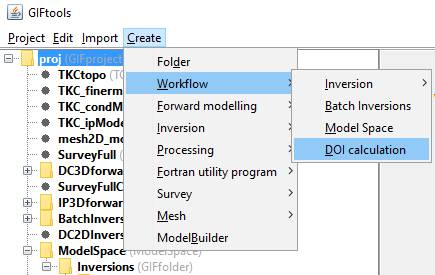
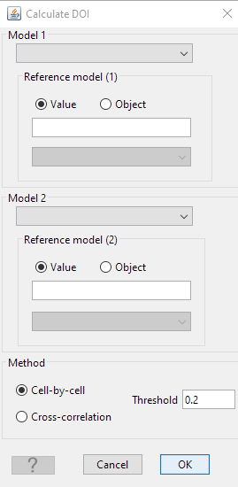
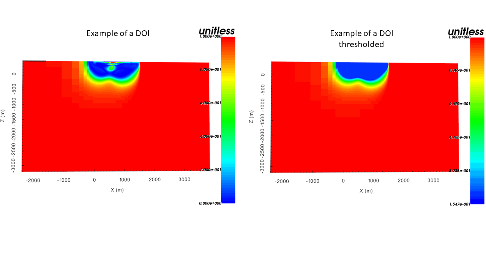

.. _objectFunctionalityWorkflowDOICalc:

.. include:: <isonum.txt>

Depth of investigation (DOI) calculation
========================================

With the ``DOI`` Workflow, the user can compare two models in order to
estimate the robustness of geophysical anomalies. The resulting DOI index can be
visualized and used as weights in subsequent inversions.

**Create** |rarr| **Workflow** |rarr| **DOI calculation**

.. _objectFunctionalityWorkflowDOIEdit:

Edit Options
^^^^^^^^^^^^

DOI calculations follow the work presented in `Li & Oldenburg 1999 <http://www.eos.ubc.ca/ubcgif/pubs/papers/geop64-403.pdf>`_.
The calculation requires two models and their respective reference values.

- **model 1 (& 2)**
    inverted models with two different reference models
- **reference 1 (& 2)**
    reference models used in the inversion
- **method**
    - option 1: Cell-by-cell. The first method looks at the deviation of models normalized by the difference in reference value on a cell-by-cell basis:

    .. math::

	   R(x,y) = \frac{m_1(x,z) - m_2(x,z)}{m_1^{ref}-m_2^{ref}}

    where :math:`m_1` and :math:`m_2` are the two chosen models and :math:`m^{ref}_1` and :math:`m^{ref}_2` their respective background referencemodels. Model parameters with large R values are assign high credibility.

    - option 2: Cross-correlation: The second strategy measures the difference between two images over `n` cells in a rectangular window. The cross-correlation between the two models are calculated as

    .. math::

	   C = \frac{ \sum_i^N (m_{1_i}-\bar m_{1}) (m_{2_i}-\bar m_{2})}{\bigg( \sum_i^N (m_{1_i}-\bar m_{1})^2 \sum_i^N (m_{2_i}-\bar m_{2})^2\bigg)^{(1/2)}}

    where :math:`\bar m` is the average of the model over the window. The DOI index is calculated by

    .. math::
	   R = \frac{C-1}{2}

- **threshold**
    Threshold used on the DOI to cut the models.

Output
^^^^^^

- **reference model 1 (& 2)**
    reference models used for the computation

- **DOI**:
    Computed DOI

- **DOI_Thresholded**
    DOI model which has been thresholded (with the input `thresold`) at the surface to highlight the area of interest (see figure below for an example).

- **DOI_Masked_model1 (&2)**
    Model masked based on the thresholded DOI.

