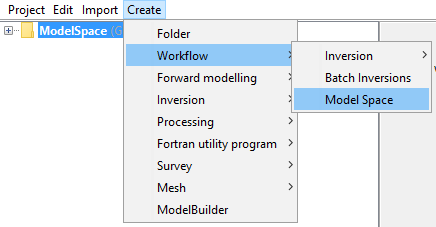
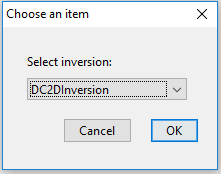
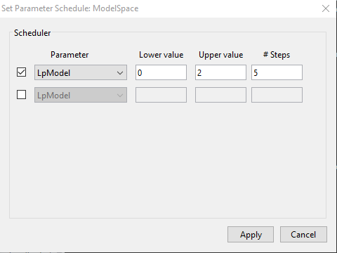

.. _objectFunctionalityWorkflowModelSpace:

.. include:: <isonum.txt>

Model Space
===========

With the ``Model Space`` Workflow, the user can explore the solution space
associated with underdetermined inverse problems. The workflow proceeds with a
series of inversion over a range of parameter values. The resulting models can
be visualized and compared along set cross sections.

**Create** |rarr| **Workflow** |rarr| **Model Space**

Set inversion object
^^^^^^^^^^^^^^^^^^^^

This option will prompt a menu for the selection of an ``Inversion`` object
used as a template for all subsequent inversions. Only the inversion parameter
under investigation will be altered for subsequent inversions

**Workflow** |rarr| **Set Template**

.. _objectFunctionalityWorkflowModelSpaceEdit:

Edit Options
^^^^^^^^^^^^

This option sets the range of inversion parameters to iterate over.
Values for :math:`\alpha`, :math:`m_{ref}`, :math:`m_{0}` are available for all inversion objects.
``MAGINV3D_v6`` and ``GZINV3D_v6`` allow for sparsity on model values :math:`p`-value and model gradients :math:`q`-values.

**Workflow** |rarr| **Edit Options**

Write All
^^^^^^^^^

This option creates the files and directories needed for the individual
inversions These are stored to disk, along with a Python script for the
execution.

**Workflow** |rarr| **Write all**

.. _objectFunctionalityWorkflowModelSpaceRun:

Run
^^^

**Workflow** |rarr| **Run**

OPTION 1: Run locally
---------------------

Just as for any other inversion programs, the Fortran executable can be called locally.
Make sure you have sufficient resources to run the inversion.

OPTION 2: Run remotely
----------------------

To run the inversion on a remote computer, the user will need to
copy the content of the inversion directory as well as the
``BatchInversion.py`` script.

To run the script type in a command line:

``python BatchInversion.py [Directory] [FortranCode]``

where:

 ``[Directory]`` is the relative path between the python script and the input files. If the same folder, use ``.\``

``[FortranCode]`` is name of the inversion routine to be used (e.g. ``dcinv2d``, ``maginv3d``)

.. _objectFunctionalityWorkflowModelSpaceLoad:

Load All
^^^^^^^^

Selecting this option triggers GIFtools to seek for results in the
corresponding list of directories associated with individual inversion
objects. If the inversion was run on a remote machine, the directories must be
copied in the working directory of the parent ``BatchInversion``. Only the
last model and predicted will be loaded, but convergence curves can be viewed.

**Workflow** |rarr| **Load All**

Export Section
^^^^^^^^^^^^^^

In order to compare multiple models at once, individual sections can be
exported using the :ref:`Model Extraction <objectMeshExtractSections>` tool.

**Workflow** |rarr| **Extract Sections**
