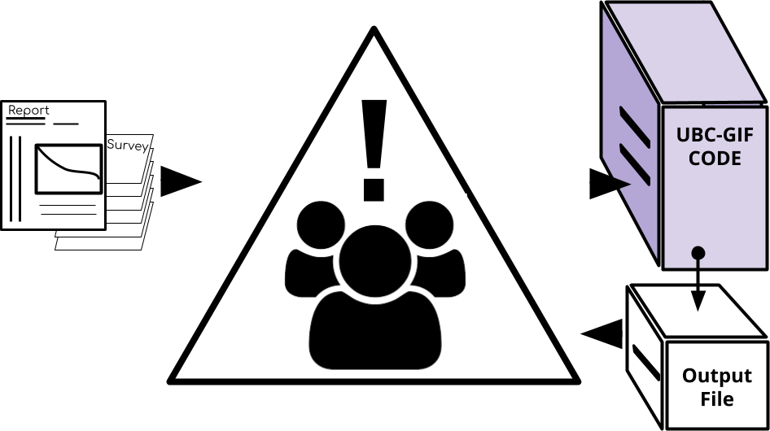

.. _quickStartGuide:

.. warning:: The GIFtools cookbook provides supporting documentation for **proprietary software** developed by the UBC Geophysical Inversion Facility. Currently, GIFtools software is **only accessible** by the consortium of companies which funded the GIFtools project. Plans to commercialize this software is underway.

GIFtools quick-start guide
==========================

- :ref:`Framework <framework>`
- :ref:`Interface (GUI) <GUI>`

Why GIFtools ?
--------------

The UBC-Geophysical Inversion Facility (GIF) has developed a large number of
high-performance forward modeling and inversion codes over the last decades.
While proving to be useful in characterizing the sub-surface, the
usability of these codes remained challenging due to the number of complex
tasks needed from the user:

(1) Gather and format a wide range of geoscientific data

(2) Interact with various Fortran codes and utilities

(3) Manage and archive projects

GIFtools has been designed to facilitate the interaction between the practicing
geophysists and the various forward and inversion codes through a modular :ref:`Framework <framework>`. The front-end of
GIFtools is its Graphical User Interface (:ref:`GUI <GUI>`) menu structure.

.. _framework:

GIFtools Framework
------------------

The GIFtools Framework has been designed to store, visualize and modify the
different :ref:`Objects <objectFunctionality_index>` needed to interact with
the various Fortran executable. In computer language, an **object** is a
container holding a set of attributes and functions that can be used to
perform tasks. You can think of it as computer hardware. For example, a
:ref:`GIFdata <objectFunctionalityData>` object knows all the necessary
details about the geophysical experiment (location, receivers, units, etc.)
and can perform actions (add/substract, write to file, plot, etc.)

**Objects** can be linked to each other, like building blocks, to achieve
more complex tasks. For example, a :ref:`Model <objectFunctionalityModel>` needs a :ref:`Mesh <objectFunctionalityMesh>` in order to exist in 3D
and be visualized.

More complex objects, such as a :ref:`GIFinversion <objectFunctionalityInv>`,
need to know about many other objects in order to exist (:ref:`Data
<objectFunctionalityData>`, :ref:`Mesh <objectFunctionalityMesh>` and
:ref:`Model <objectFunctionalityModel>`). Once all the pieces are connected,
the inversion object can interact with external Fortran codes and knows how to
handle the various outputs.

.. _GUI:

Graphical User Interface (GUI)
------------------------------

The next four subsections will describe the main components of GIFtools pointed out below:

The following video also introduces the look and feel of GIFtools:

.. raw:: html

        

        <iframe width="560" height="315" src="https://www.youtube.com/embed/Kqm0TyNJ-vQ" frameborder="0" allowfullscreen></iframe>
        

Menus
^^^^^
GIFtools is **menu** driven. To perform any action, the user can select from the appropriate menu at the top of the GIFtools window (or right-click the object to bring up the menu options). The four main menus that are always available are:

#. **Project**: This menu allows you to save / load / add a project, set the working directory (where the project will write/look for files) or set the number of OpenMP threads (for running inversions).

#. **Edit**: This menu will let you rename, copy, or delete the object that is currently selected.

#. **Import**: This is the main menu structure for importing items (data, meshes, etc) into GIFtools (see :ref:`Importing Files <import>` for a list of items to import).

#. **Create**: This menu allows the user to create items such as Folders (to keep the tree organized; see below), Workflows, Inversions, and other items that may call Fortran executables created by UBC-GIF

Beyond these four menus, additional menus will appear depending upon the item that is selected, such as ``Visualization`` (above is an example when selecting a mesh3D item):

Tree
^^^^

All of the items in GIFtools fall under a **GIFproject**. Beyond that, each is present in the tree structure on the right-side. Folders can be created or are transformed (in the case of inversions that have been loaded) to contain other items. In the above case, the gravity gradiometry data (GGdata object), topography (TOPOdata object), and mesh (mesh3D object) are in the folder ``final``, but are still in the project. To move items to a folder, simply **left-click, drag-and-drop** the item into the folder. To get items back to the main project folder, drag-and-drop to the GIFproject at the very top.

Information panel
^^^^^^^^^^^^^^^^^

Every item selected has a panel that shows up on the right-side of the main GIFtools window. This panel gives the user a brief over-view of the item, such as the number of cells for a mesh, or the number of frequencies in an FEMdata (Frequency-ElectroMagnetics Data) item. For data items, certain columns must be denoted in order to export them for inversion. These are known as :ref:`input/output headers <objectSetioHeaders>` (often referred to as ``i/o headers``).

Notes section
^^^^^^^^^^^^^

This is a section where a log of what has happened to the selected item is recorded. Additionally, users may write their own comments in this section to remind them what was performed. To write notes, click on the note section and begin typing.

.. _tutorials:

Need Help?
^^^^^^^^^^

When you get to a dialog box and are not sure what to do, look for the question mark button:

The button will link you to a short tutorial on how (a) you got there and (b)
what to do inside the dialog box. If you find a bad link, let us know `here <https://github.com/ubcgif/help>`_ !

