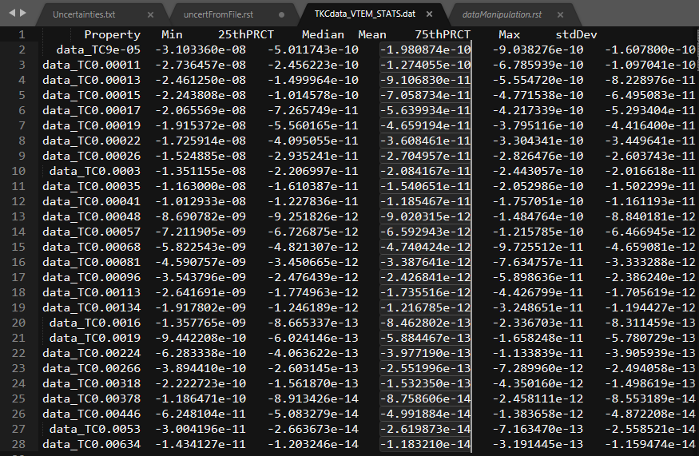
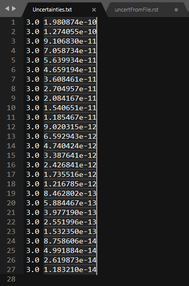

.. _recipe_data_createUncertFile:

.. include:: <isonum.txt>

Create Time/Frequency dependent uncertainties from Statistics
=============================================================

Here we provide a recipe for creating time/frequency based uncertainties based
on data statistics. This recipe can save users a tremendous amount of time
when dealing with dataset comprising many time/frequency channels with data
spanning several orders of magnitude.

Step 1: Export data statistics
------------------------------

Floor values are generally used to level the contribution of each
times/frequencies. We will use statistics to get reasonable values.

 - :ref:`Export -> Statistics <objectDataExportSTATS>`

Step 2: Create a column file [% | floor]
----------------------------------------

- Open the exported file
- Select and copy any of the columns (e.g. median)

.. tip:: The GIFtools Team recommends to use `Sublime Text <https://www.sublimetext.com/3>`_  as text editor. Press ``shift+rightClick`` for column selection.

Step 3: Create a column file [% | floor]
-----------------------------------------

- Create a new file in your project directory and paste the column
- Add a column corresponding to the desired percentage value

    Uncertainty file made for a ``TEMdata`` object containing 27 tile channels.
    Assigned 3% uncertainty with  adaptive floor to account for dynamic range
    across time channels.

