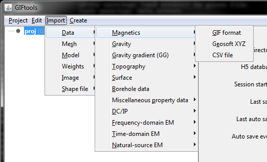
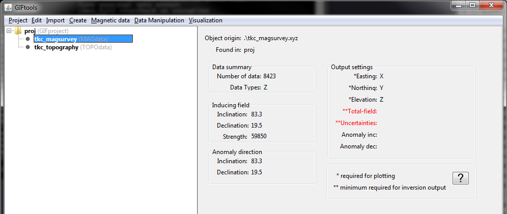
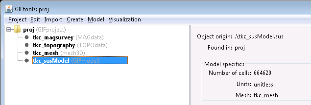
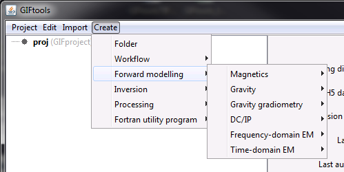
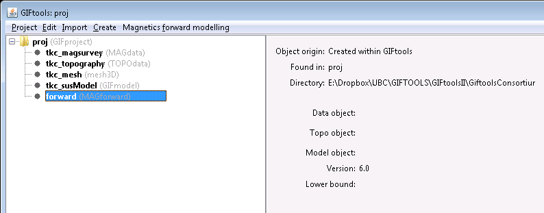
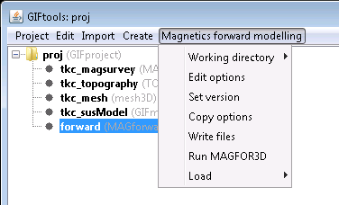
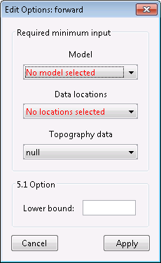
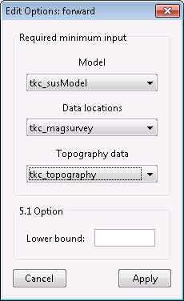
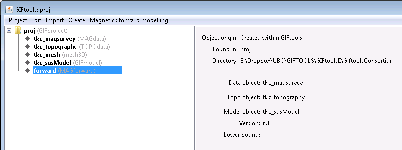

.. _fwdModData:

.. include:: <isonum.txt>

Forward model data in GIFtools
==============================

In this recipe, we step through forward modelling data, starting from a survey file, a topography file, a 3D mesh, and a physical property model. At the bottom of this page, you will find the :ref:`files used in this recipe as well as the complete project and output files <fwdmodExample>`. This recipe uses a magnetic survey file and a susceptibility model on a 3D mesh but the steps are nearly identical for each data and mesh type in GIFtools.

This recipe requires the following steps:

#. :ref:`Import a survey, topography, a mesh, and a model <fwdmodStep1>`
#. :ref:`Create a forward model item in GIFtools <fwdmodStep2>`
#. :ref:`Edit the options <fwdmodStep3>`
#. :ref:`Write the files <fwdmodStep4>`
#. :ref:`Run the forward modelling <fwdmodStep5>`
#. :ref:`Import the predicted data <fwdmodStep6>`

.. _fwdmodStep1:

**STEP 1: import a survey, a mesh, and a model**

Start GIFtools or open an already existing project. Because we will be loading in a few files, it is easiest to :ref:`set the working directory <projSetWorkDir>` to the folder where the files are located and/or where you would like to do the forward model.

The first step is then to import the magnetic airborne survey locations and the topography file. :ref:`Importation of data <importData>` will slightly differ, depending on the file type (GIF format, XYZ, etc). For this example, the magnetic survey file is structured as a XYZ while the topography file is in GIF format. Both are imported using the following menus:

- For magnetic survey locations: **Import** |rarr| **Data** |rarr| **Magnetics** |rarr| XYZ
- For topography: **Import** |rarr| **Data** |rarr| **Topography** |rarr| 3D GIF (3D XYZ)

For the magnetic data, we also need to :ref:`set the inclination, declination, and field strength <objectEditFieldParam>`. This can be done through the data manipulation menu.

Once the data are loaded, GIFtools will have the two items shown in the project tree on the left:

It's a good idea to regularly :ref:`save <projSave>` your project!

Now we :ref:`import the 3D mesh <importMesh3D>` and :ref:`import the associated model <importModel>`. To do so, use the menus as following:

- For the 3D mesh: **Import** |rarr| **Mesh** |rarr| **3D**
- For the physical property model: **Import** |rarr| **Model** |rarr| **Cell centred**

We now have 4 items in the GIFtools project tree:

.. _fwdmodStep2:

**STEP 2: Create a forward model item in GIFtools**

With all files loaded, we are ready to :ref:`create the forward modelling item <createForward>`. These can be accessed through the menu structure:

**Create** |rarr| **Forward modelling**

For the magnetic example in this recipe, we will choose the MAG3D code (version 6.0):

**Create** |rarr| **Forward modelling** |rarr| **Magnetics** |rarr| **MAG3D (v6.0)**

Choose a directory to write files to and run the forward modelling in. Click "Open". You will now see the forward model item in the GIFtools project tree on the left. For this example, it's called "forward (MAGforward)". You can always rename the first part of the name. The second part tells you what type of data is being forward modelled and/or which code is used.

The info panel shows you which data item, topography, and model are being used. Depending on the code, the info panel will show other relevant information and parameters.

.. _fwdmodStep3:

**STEP 3: Edit the options**

Each forward modelling item has its own menu which contains the following:

- Working directory (to set or view)
- Edit options
- Copy options
- Write files
- Run ``code``
- Load (to import predicted data and locations file)

Depending on the code, some other options might be included in the menu, such as "Set version" for magnetics.

Using the menu, select "Edit options". This brings up a dialog where the different parameters can be set. For the magnetics example, it looks like:

Set each of the parameters by using the dropdown menus or filling in a value or text field. In the case of our example, the completed dialog looks like:

Click "Apply" to set the options. You can always access the dialog again through the menu to make changes.

.. note:: If the forward model has run, GIFtools does not allow you to edit the options anymore. However, you can copy the options (through the menu), and then change the parameters on the copied item.

Once the options are set, the info panel will update to reflect the set parameters.

.. _fwdmodStep4:

**STEP 4: Write the files**

Now that the options are set, we can write the files to the working directory. To do this, use the menu for the forward model item. For our example using magnetics, we use the following menu structure:

**Magnetics forward modelling** |rarr| **Write files**

Once the files are written, GIFtools pops up a message saying "The supporting files were written." Click "OK" to close the message.

If you navigate to the working directory, you will find the supporting files as well as an input file (if the code requires one. MAG3D doesn't.)

.. _fwdmodStep5:

**STEP 5: Run the forward modelling**

To run the forward modelling code, use the menu and select **Run ``code``**. For magnetics, this menu is as following:

**Magnetics forward modelling** |rarr| **Run MAGFOR3D**

A command window will pop up and the code will start running. In the meantime, you can still interact with GIFtools to continue working.

Once the forward modelling is done, close the command window. In the working directory, you will find the output files.

.. _fwdmodStep6:

**STEP 6: Import the predicted data**

The output files can be quickly loaded into GIFtools using the menu structure for the forward modelling item. In the case of magnetics, this is the menu to load predicted data:

**Magnetics forward modelling** |rarr| **Load** |rarr| **Predicted data**

Once loaded, the forward modelling item will become a folder and the predicted data will be added to the folder.

For some forward modelling codes, you can also import the locations file:

**Magnetics forward modelling** |rarr| **Load** |rarr| **Locations file**

.. note:: One error message that is most likely to appear is one saying that the code isn't found in the path. When creating the forward modelling item, GIFtools automatically looks for the code executable and warns you if it cannot find it.

.. note:: Once the forward model has run, GIFtools does not allow you to edit the options anymore. However, you can copy the options (through the menu), and then change the parameters on the copied item.

.. _fwdmodExample:

.. example:: The magnetics survey file, topography file, field parameter notes, 3D mesh, and susceptibility model along with a GIFtools project to repeat the above steps to forward model data: `download <https://www.eoas.ubc.ca/~sdevries/GIFtoolsExamples/ForwardModelData_example.zip>`__

