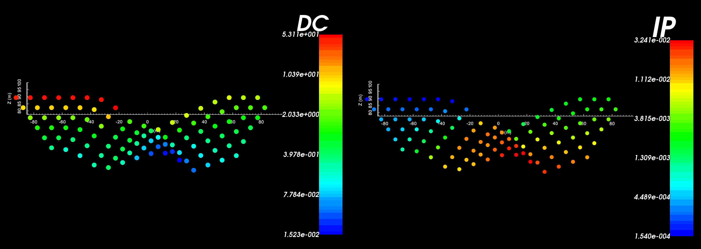

.. _recipe_fwd_dcip2d:

.. include:: <isonum.txt>

Forward Model 2D DC and IP Data
===============================

In this recipe, we demonstrate the 2-step processes of forward modeling 2D DC and IP data. DC data can be predicted using a conductivity model alone, however IP data requires both a conductivity and chargeability model. This recipe has 3 steps:

    1. Load files (optional)
    2. Predict DC data and load results
    3. Predict IP data and load results

**Required GIFtools Objects:**

    - 2D tensor mesh
    - 2D topography
    - Electrode Locations (A B M N)
    - 2D conductivity model
    - 2D chargeability model
    

`Download .zip file <https://github.com/ubcgif/GIFtoolsCookbook/raw/master/assets/recipe_fwd_dcip2d.zip>`__ for a set of example files.

Load Files
----------

    - :ref:`Import 2D tensor mesh <importMesh2D>`
    - :ref:`Import 2D topography (2D GIF format) <importTopo>`
    - :ref:`Import 2D DC/IP locations file <importDCIP2Ddata>`
    - :ref:`Import conductivity model <importModelCellCentered>`
    - :ref:`Import chargeability model <importModelCellCentered>`

.. figure:: ../images/dcip2d_true_model.png
    :align: center
    :width: 700

    Conductivity (left) and chargeability (right) models download from .zip file

Predict DC Data and Load Results
--------------------------------

To predict DC data and load the results into GIFtools, carry out the following steps:

    - :ref:`Create 2D DC forward modeling object <createDCIPFwd>`: The forward modeling object is created to provide a single item that 1) contains all parameters relevant to the forward model and 2) keeps track of which mesh, data locations etc. are being used in the forward model.

    - :ref:`Set the forward modeling parameters through edit options <fwdEditOptions_dcip2d>`: Before we can predict data we must define the mesh, conductivity model, electrode locations, topography and other parameters. This is done through edit options.

    - :ref:`Write files <fwdWriteAll>`: Once the parameters are set for the forward model, this command is used to write all the input files for the Fortran code into the specified directory. If you have not set the working (output) directory or would like to change the working directory, use :ref:`set working directory <fwdSetWorkDir>`.

    - :ref:`Run the forward model <fwdRun>`: The forward model can be run directly from GIFtools using the forward modeling object.

    - :ref:`Load predicted data <fwdLoadResults>`: Once completed, GIFtools can be used to load the predicted data. Since the predicted data are unique to the forward modeling object, the predicted data are loaded into that folder.

    Edit options tabs showing inputs for test example.

Predict IP Data and Load Results
--------------------------------

To predict IP data and load the results into GIFtools, carry out the same steps as before:

    - :ref:`Create 2D IP forward modeling object <createDCIPFwd>`

    - :ref:`Set the forward modeling parameters through edit options <fwdEditOptions_dcip2d>`: Here, we require both a conductivity and chargeability model.

    - :ref:`Write files <fwdWriteAll>`

    - :ref:`Run the forward model <fwdRun>`

    - :ref:`Load predicted data <fwdLoadResults>`

    Edit options tabs showing inputs for test example.

Results
-------

        Pseudo-section DC data (left) and IP data (right) from the test example. Notice the effect of the surface topography on the data points.

