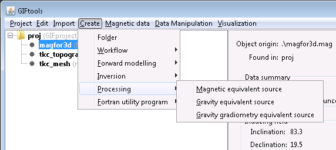
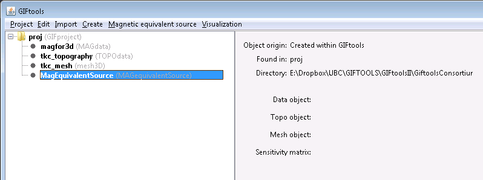
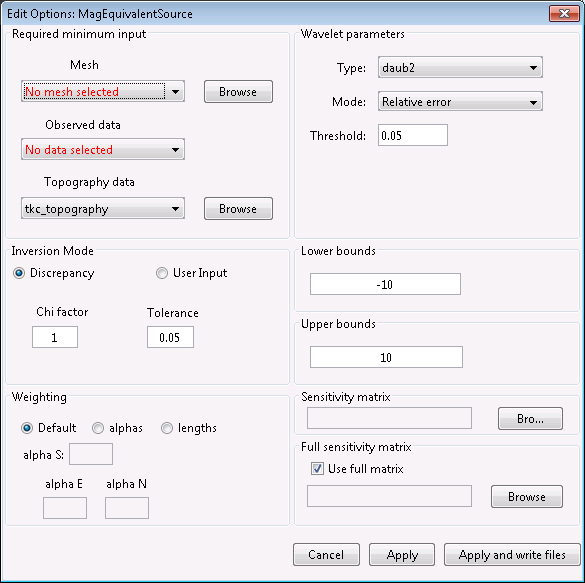

.. _ESrecipe:

.. include:: <isonum.txt>

Do an equivalent source inversion through GIFtools
==================================================

.. caution:: The equivalent source code is currently under review. Beware of topographic effects in the forward data.

In this recipe, we step through an equivalent source inversion using magnetic data, starting from a TMI data file, a topography file, and a 3D mesh. At the bottom of this page, you will find the :ref:`files used in this recipe as well as the complete project and output files <esExample>`. The steps for doing an equivalent source inversion for gravity and gravity gradiometry are very similar to this.

This recipe requires the following steps:

#. :ref:`Import the necessary files <ampStep1>`
#. :ref:`Invert for an equivalent source model <ampStep2>`

.. _ampStep1:

**STEP 1: Import the necessary files**

Start GIFtools or open an already existing project. Because we will be loading in a few files, it is easiest to :ref:`set the working directory <projSetWorkDir>` to the folder where the files are located and/or where you would like to do the forward model.

The first step is then to import the magnetic data, the topography file, and the 3D mesh. :ref:`Importation of data <importData>` can slightly differ, depending on the file type (GIF format, XYZ, etc). For this example, the magnetic data and the topography file are both in GIF format. Both are imported using the following menus:

- For magnetic survey locations: **Import** |rarr| **Data** |rarr| **Magnetics** |rarr| GIF format
- For topography: **Import** |rarr| **Data** |rarr| **Topography** |rarr| 3D GIF (3D XYZ)
- For the 3D mesh: **Import** |rarr| **Mesh** |rarr| **3D**

.. figure:: ../../../images/createOctreeMesh/importdata.png
        :figwidth: 75%
        :align: center

.. note:: Note that the mesh does not have any padding in the vertical direction, as required for the equivalent source problem.

Once the data are loaded, GIFtools will have the three items shown in the project tree on the left. It's a good idea to regularly :ref:`save <projSave>` your project!

.. note:: If you have a susceptibility model, you can :ref:`import the model <importModel>` and skip directly to :ref:`forward modeling the amplitude data <ampStep3>`.

Before we can solve for an equivalent source model for this magnetic data, we need to :ref:`set the I/O for the data and uncertainties <objectSetioHeaders>`. This means we need to assign uncertainties to the data first assignUncert (link needed).

Use the menu structure to set the uncertainty for the magnetic data:

**Data Manipulation** |rarr| **Assign uncertainties**

A dialog pops up to add a percentage and/or a floor to each header. We completed the dialog by clicking the **Assign** checkbox for the header "B" and using 0 for percentage and 0.5 nT for the floor. Click "OK" to apply the changes. Now use the menu structure to set the I/O headers for the data:

**Data Manipulation** |rarr| **Set I/O headers**

For this example, make sure the total-field anomaly is set the "B" and the uncertainty to "B_uncert" by choosing these from the drop-down boxes. Click "OK" to close the dialog and apply the changes. The info panel for the magnetic data item will have updated and all minimum data requirements for the inversion are now set (indicated using ** in the info panel).

.. _ampStep2:

**STEP 2: Invert for an equivalent source model**

Now we can invert for an equivalent source model. To create the equivalent source item, use the menu structure in GIFtools as following:

**Create** |rarr| **Processing** |rarr| **Magnetic equivalent source**

Choose a directory to write files to and run the equivalent source in. Click "Open". You will now see the equivalent source item in the GIFtools project tree on the left. For this example, it's called "MagEquivalentSource (MAGequivalentSource)". You can always rename the first part of the name.

.. figure:: ../../../images/createInversion/step2.png
        :figwidth: 75%
        :align: center

The info panel shows you which data item, topography, and mesh are being used. In addition, it will show you the sensitivity filename.

The equivalent source item has its own menu which contains the following:

- Working directory (to set or view)
- Edit options
- Copy options
- Write
- Run
- Load results

It also has a visualization menu. These menus are identical to those for an inversion item so we refer you to the :ref:`inversion recipe <invertData>` for more information on each one.

Use the menu and select **Edit options**. The dialog shown below pops up:

See the `MAGES manual <http://mages.readthedocs.io/en/latest/>`_ (which can be accessed via the `GIF documentation page <http://gif.eos.ubc.ca/documentation>`_ too) for detailed information about each parameter.

In this example, set the mesh, data, and topography. We will leave the remaining parameters set to the default values. Click "Apply and write files" to set the changes and write the files to the working directory. A message will appear to state that the files have been written. Click "OK".

Next, use the menu to run the equivalent source. Use the "all" options to run both the sensitivity and the inversion. A command window will pop up and the code will run. Once finished, close the command window. In GIFtools, use the menu to load the last result:

**Magnetic equivalent source** |rarr| **Load results** |rarr| **Last result**. The equivalent source item will become a folder, with two subfolders (one for predicted data and one for the models).

If you view the model (use the visualization menu for the recovered GIFmodel), you'll see it is a single layer, just below the topography.

.. _esExample:

.. example:: The magnetics data file, topography file, and 3D mesh along with a GIFtools project to repeat the above steps to calculate the equivalent source model: `download <https://www.eoas.ubc.ca/~sdevries/GIFtoolsExamples/ForwardModelAmplitudeData_example.zip>`__

