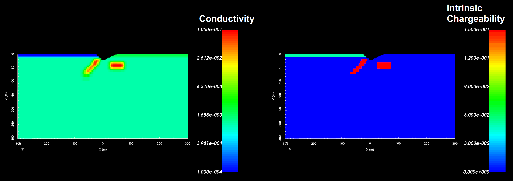
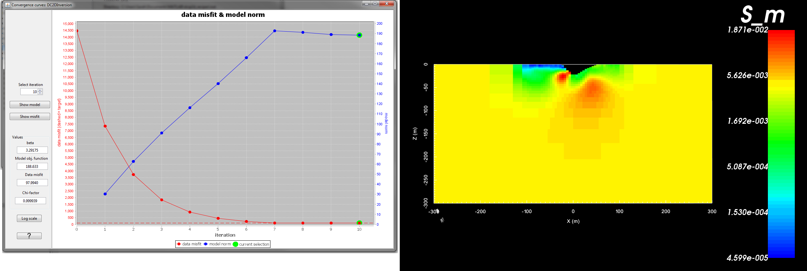
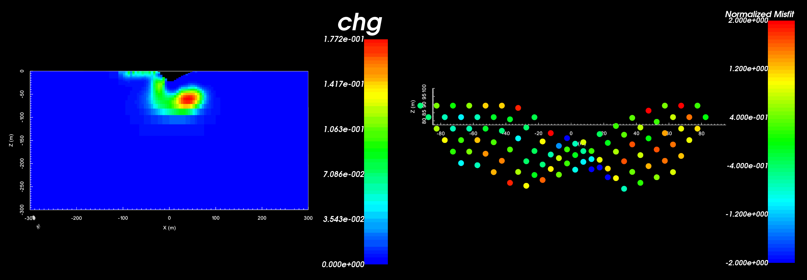

.. _recipe_inv_dcip2d:

.. include:: <isonum.txt>

Invert 2D DC and IP Data
========================

In this recipe, we demonstrate the 2-step processes of inverting 2D DC and IP data. DC data can be inverted without a background model, however IP data a background conductivity. This recipe has 3 steps:

    1. Load files (optional)
    2. Invert DC data and load results
    3. Invert IP data and load results

**Required GIFtools Objects:**

    - 2D tensor mesh
    - 2D topography
    - DC data (with uncertainties)
    - IP data (with uncertainties)

`Download .zip file <https://github.com/ubcgif/GIFtoolsCookbook/raw/master/assets/recipe_inv_dcip2d.zip>`__ for a set of example files.

Load Files
----------

    - :ref:`Import 2D tensor mesh <importMesh2D>`
    - :ref:`Import 2D topography (2D GIF format) <importTopo>`
    - :ref:`Import DC data <importDCIP2Ddata>`
    - :ref:`Import IP data <importDCIP2Ddata>`

    True conductivity (left) and chargeability (right) models we hope to recover.

Invert DC Data and Load Results
-------------------------------

To invert DC data and load the results into GIFtools, carry out the following steps:

    - :ref:`Create 2D DC inversion object <createDCIPInv>`: The inversion object is created to provide a single item that 1) contains all parameters relevant to the inversion and 2) keeps track of which mesh, data locations etc... are being used in the inversion.

    - :ref:`Set the inversion parameters through edit options <invEditOptions_dcip2d>`: Before we can invert DC data we must define the mesh, survey data, topography and inversion parameters. This is done through edit options.

        .. figure:: ../images/dcip2d_inv_edit_options.png
            :align: center
            :width: 500

            Edit options tabs showing inputs for test example.

    - :ref:`Write files <invWriteAll>`: Once everything is set for the inversion, this command is used to write all the input files for the Fortran code into the specified directory. If you have not set the working (output) directory or would like to change the working directory, use :ref:`set working directory <invSetWorkDir>`.

    - :ref:`Run the inversion <invRun>`: The forward model can be run directly from GIFtools using the inversion object.

    - :ref:`Load results <invLoadResults>`: Once completed, GIFtools can be used to the predicted data and models for each iteration. Since the results are unique to the inversion object, the results are loaded into that folder.

    - :ref:`Examine convergence curves <convergence_curve>`, model and misfit maps: Once the inversion has terminated, it is beneficial to examine the convergence towards the final model. This analysis will indicate whether the inversion has hit the target misfit and provide some insight as to whether the assigned data uncertainties were reasonable. The quality of the recovered model can also be assessed by looking at the model itself or the misfit between the predicted and observed data.

    Convergence curves (left) and recovered conductivity model - 7th iteration (right) for the test example using the above parameters.

Invert IP Data and Load Results
-------------------------------

To invert IP data and load the results into GIFtools, carry out a similar set of steps:

    - :ref:`Create 2D IP inversion object <createDCIPInv>`

    - :ref:`Set the inversion parameters through edit options <invEditOptions_dcip2d>`: The inversion requires that the user specify a background conductivity model.

    - :ref:`Write files <invWriteAll>`

    - :ref:`Run the inversion <invRun>`

    - :ref:`Load results <invLoadResults>`

    - :ref:`Examine convergence curves <convergence_curve>` and model

    Recovered chargeability model - 8th iteration (left) and corresponding normalize data misfit (right). The chargeability was recovered using the conductivity model from the 7th iteration of the DC invesion.

