.. _invertData:

.. include:: <isonum.txt>

Invert data in GIFtools
=======================

In this recipe, we step through inverting data, starting from a data file, a 3D mesh, and a topography file. At the bottom of this page, you will find the :ref:`files used in this recipe as well as the complete project and output files <invExample>`. This recipe uses a magnetic data file and a 3D mesh but the steps are nearly identical for each data and mesh type in GIFtools.

This recipe requires the following steps:

#. :ref:`Import a data file, a mesh, and a topography file <invStep1>`
#. :ref:`Create an inversion item in GIFtools <invStep2>`
#. :ref:`Edit the options <invStep3>`
#. :ref:`Write the files <invStep4>`
#. :ref:`Run the inversion <invStep5>`
#. :ref:`Import the recovered models and predicted data <invStep6>`
#. :ref:`View the convergence curve, misfit maps, and more <invStep7>`

.. _invStep1:

**STEP 1: Import a data file, a mesh, and a topography file**

Start GIFtools or open an already existing project. Because we will be loading in a few files, it is easiest to :ref:`set the working directory <projSetWorkDir>` to the folder where the files are located and/or where you would like to do the forward model.

The first step is then to import the gravity data and the topography file. :ref:`Importation of data <importData>` will slightly differ, depending on the file type (GIF format, XYZ, etc). For this example, the gravity data file is structured as a XYZ while the topography file is in GIF format. We also need to :ref:`import a 3D mesh <importMesh3D>`. All three are imported using the following menus:

- For gravity data: **Import** |rarr| **Data** |rarr| **Gravity** |rarr| XYZ
- For topography: **Import** |rarr| **Data** |rarr| **Topography** |rarr| 3D GIF (3D XYZ)
- For the 3D mesh: **Import** |rarr| **Mesh** |rarr| **3D**

.. figure:: ../../../images/createOctreeMesh/importdata.png
        :figwidth: 75%
        :align: center

Once the data and mesh are loaded, GIFtools will have three items shown in the project tree on the left:

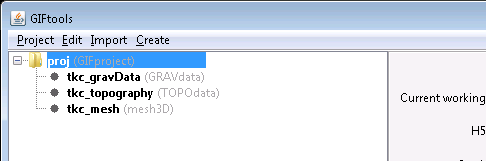

It's a good idea to regularly :ref:`save <projSave>` your project!

Before we can invert this gravity data, we need to :ref:`set the I/O for the data and uncertainties <objectSetioHeaders>`. This means we need to **assign uncertainties to the data first (link needed)**.

Use the menu structure to set the uncertainty for the gravity data:

**Data Manipulation** |rarr| **Assign uncertainties**

A dialog pops up to add a percentage and/or a floor to each header. We completed the dialog as following for the gravity example, using 0 for percentage and 0.01 for the floor:

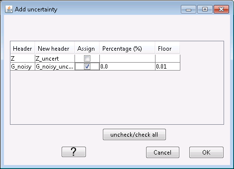

Click "OK" to apply the changes. Now use the menu structure to set the I/O headers for the data:

**Data Manipulation** |rarr| **Set I/O headers**

For this gravity example, select the vertical gravity anomaly and the uncertainty from the drop-down boxes.

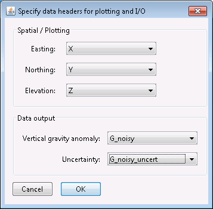

Click "OK" to close the dialog and apply the changes. The info panel for the data item will have updated and all minimum data requirements for the inversion are now set (indicated using ** in the info panel).

.. _invStep2:

**STEP 2: Create an inversion item in GIFtools**

With all files loaded and the data properly assigned, we are ready to :ref:`create the inversion item <createInv>`. These can be accessed through the menu structure:

**Create** |rarr| **Inversion**

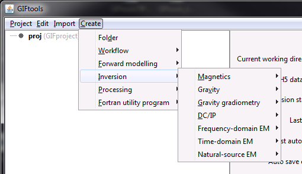

For the gravity example in this recipe, we will choose the GRAV3D code (version 6.0):

**Create** |rarr| **Inversion** |rarr| **Gravity** |rarr| **GRAV3D 6.0**

Choose a directory to write files to and run the inversion in. Click "Open". You will now see the inversion item in the GIFtools project tree on the left. For this example, it's called "gravityInversion (GRAVinversion)". You can always rename the first part of the name. The second part tells you what type of data is being inverted and/or which code is used.

.. figure:: ../../../images/createInversion/step2.png
        :figwidth: 75%
        :align: center

The info panel shows you which data item, topography, and mesh are being used. Depending on the code, the info panel will show other relevant information and parameters.

.. _invStep3:

**STEP 3: Edit the options**

Each inversion item has its own menu which contains the following:

- Working directory (to set or view)
- Edit options
- Copy options
- Write (to write supporting and input files)
- Run ``code`` (or Run |rarr| weights, sensitivity, inversion)
- Load results (to import predicted data and recovered models)

Depending on the code, some other options might be included in the menu, such as "Set version" for gravity.

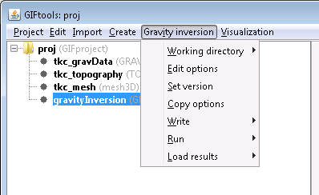

Each inversion item also has a visualization menu, which can be used to view the convergence curve, view the log file, and view inversion progress. This menu is discussed in :ref:`Step 7 <invStep7>`.

Using the menu, select "Edit options". This brings up a dialog where the different parameters can be set. For the gravity example, it looks like:

.. figure:: ../../../images/createInversion/step3a.png
        :figwidth: 75%
        :align: center

The dialog has at least two tabs. In the case for the gravity example, there are 3. The first tab will ask for the mesh, data, and topography items, as well as other code specific parameters (such as weighting and wavelets for potential fields).

Set the parameters by choosing from the drop-down menus and/or filling in text boxes. For our gravity example, the dialog looks as following:

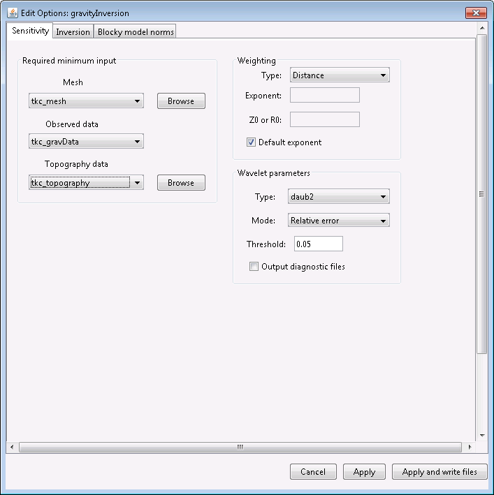

Now, click on the second tab. For the gravity inversion, it's called "Inversion":

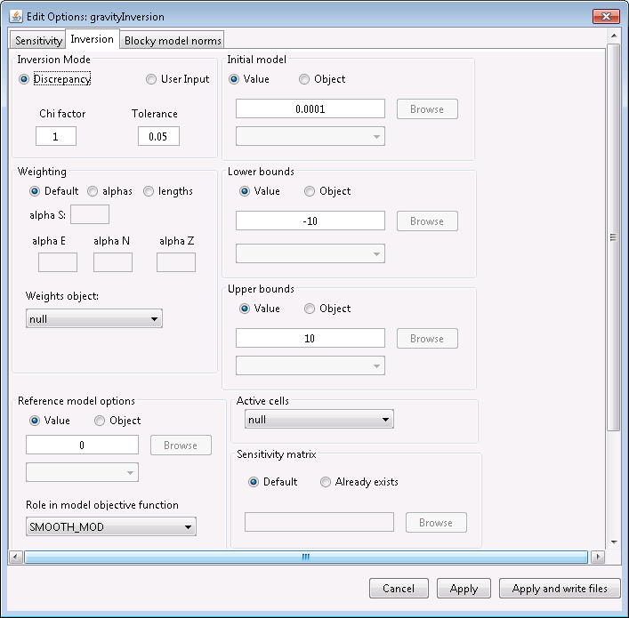

This tab allows you to set the majority of the input options. Default values are provided as much as possible. For detailed descriptions of the parameter meanings, check out the manual for the appropriate code on the `GIF documentation page <http://gif.eos.ubc.ca/documentation>`_

In this example, we are leaving all values as default. Click on the third tab (if there is one). For gravity, it is called "Blocky model norms".

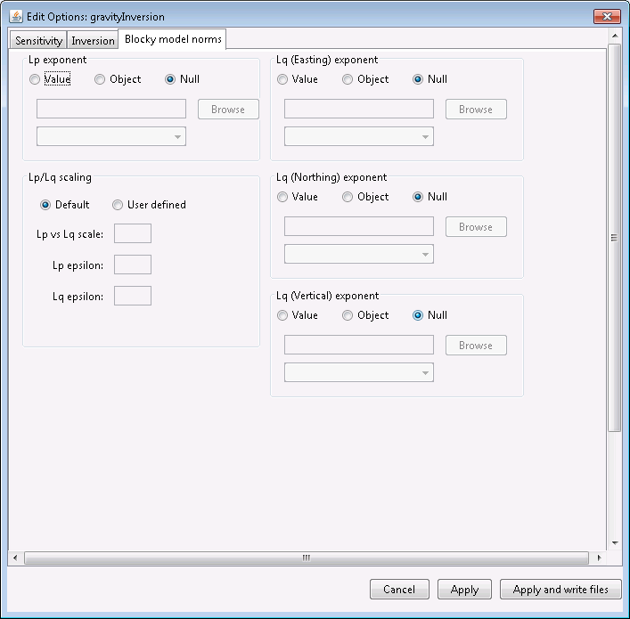

This tab allows you to set Lp-Lq specific parameters associated with version 6.0 of the gravity inversion code. For this example, we are not changing any parameters.

Once satisfied with all the parameters, click "Apply" to set the options or "Apply and write files" to set the options and write all necessary files to the working directory.

.. note:: If the inversion has run, GIFtools does not allow you to edit the options anymore. However, you can copy the options (through the menu), and then change the parameters on the copied item.

.. _invStep4:

**STEP 4: Write the files**

Now that the options are set, we can write the files to the working directory. To do this, use the menu for the inversion item. For our example using gravity, we use the following menu structure:

**Gravity inversion** |rarr| **Write files** |rarr| **All inversion files**

**Gravity inversion** |rarr| **Write files** |rarr| **PFWEIGHT Files**

**Gravity inversion** |rarr| **Write files** |rarr| **GZSEN3D Files**

**Gravity inversion** |rarr| **Write files** |rarr| **GZINV3D Files**

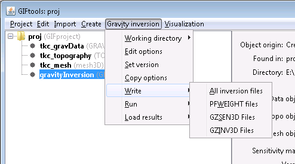

For the gravity example, use the first option to write all files. Depending on the code, GIFtools will ask you to provide a filename for in the input file.

Once the files are written, GIFtools pops up a message saying the input file(s) and supporting files were written. Click "OK" to close the message.

If you navigate to the working directory, you will find the supporting files as well as an input file(s).

.. _invStep5:

**STEP 5: Run the inversion**

To run the inversion code, use the menu and select **Run ``code``**. For gravity, this menu is as following:

**Gravity inversion** |rarr| **Run** |rarr| **All**

**Gravity inversion** |rarr| **Run** |rarr| **Weights**

**Gravity inversion** |rarr| **Run** |rarr| **Sensitivity**

**Gravity inversion** |rarr| **Run** |rarr| **Inversion**

For the gravity example, choose the first option to run all.

A command window will pop up and the code will start running. In the meantime, you can still interact with GIFtools to continue working.

Once the inversion is done, close the command window. In the working directory, you will find the output files.

.. _invStep6:

**STEP 6: Import the recovered models and predicted data**

The output files can be quickly loaded into GIFtools using the menu structure for the inversion item. In the case of gravity, this is the menu to load recovered models and predicted data:

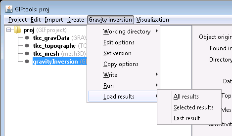

**Gravity inversion** |rarr| **Load results** |rarr| **All results**

**Gravity inversion** |rarr| **Load results** |rarr| **Selected results**

**Gravity inversion** |rarr| **Load results** |rarr| **Last result**

**All results** will load all iterations. **Selected results** will pop up a dialog where you can choose which iterations to load. **Last result** loads the last iteration only.

Once loaded, the inversion item will become a folder containing two folders: one for the recovered models, and one for the predicted data.

For the gravity example, we loaded all results, which looks like the following in GIFtools:

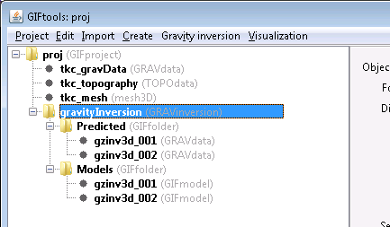

.. note:: Once the inversion has run, GIFtools does not allow you to edit the options anymore. However, you can copy the options (through the menu), and then change the parameters on the copied item.

.. _invStep7:

**STEP 7: View the convergence curve, misfit maps, and more**

Each inversion item has a second menu called "Visualization". This contains the following options:

**Visualization** |rarr| **Convergence curve**

**Visualization** |rarr| **Log file**

**Visualization** |rarr| **View progress**

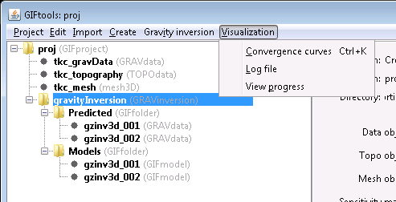

The **Convergence curve** menu item allows you to view a graph of the data misfit and model objective function per iteration and the Tikhonov curve. For the gravity example, it looks like:

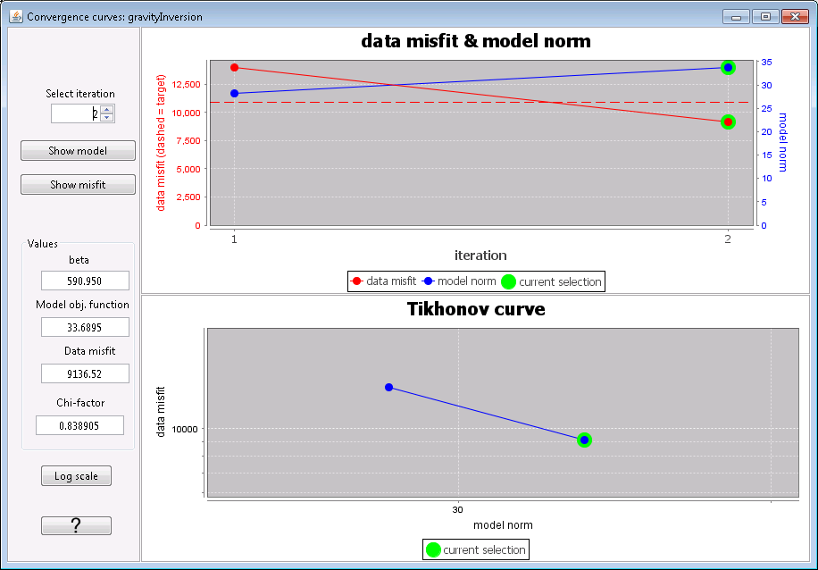

On the left side of the dialog, you can select a particular iteration and see the beta, model objective function, data misfit, and chi-factor associated with that iteration. There are also buttons to **Show model** and **Show misfit** for that iteration. Clicking these will bring up the VTK visualization with either the recovered model or the data misfit map.

The **Log file** option in the visualization menu opens the log file in a text editor.

**View progress** allows you to view the convergence curve while the inversion is running.

.. note:: One error message that is most likely to appear is one saying that the code isn't found in the path. When creating the inversion item, GIFtools automatically looks for the code executable and warns you if it cannot find it.

.. _invExample:

.. example:: The gravity data file, topography file, and 3D mesh along with a GIFtools project to repeat the above steps to invert for a model: `download <https://www.eoas.ubc.ca/~sdevries/GIFtoolsExamples/InvertData_example.zip>`__

