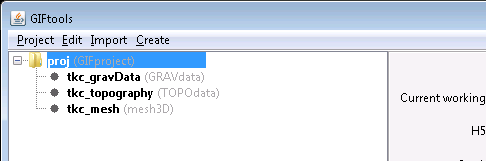
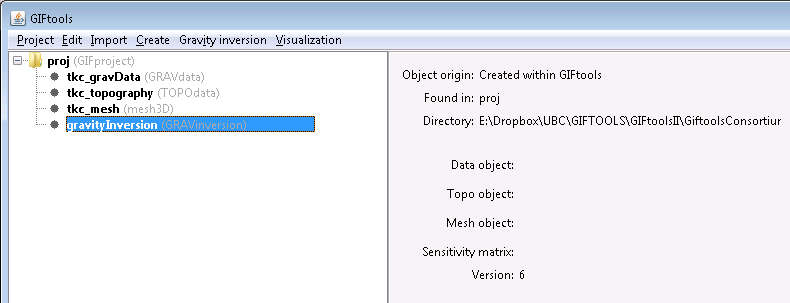
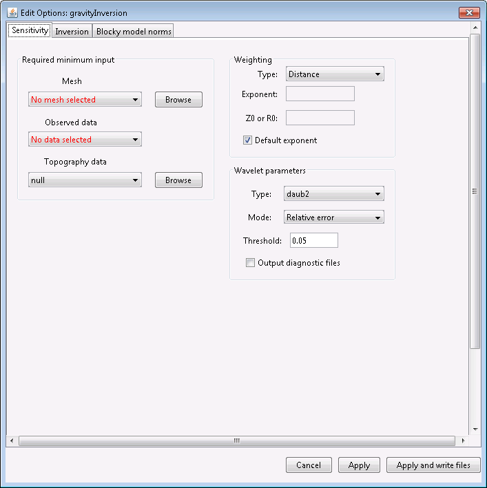
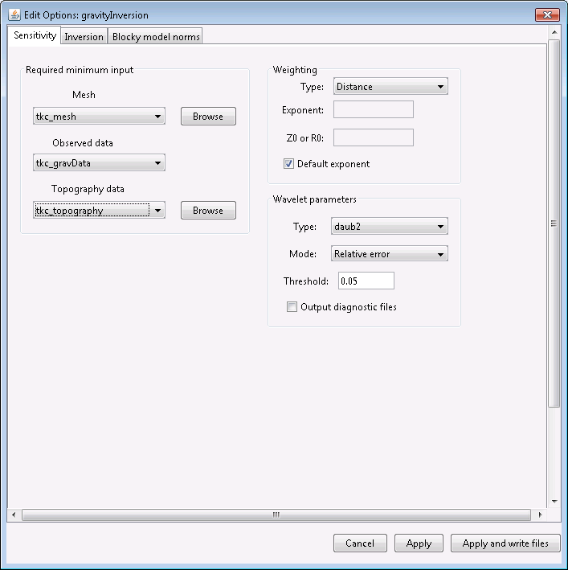

.. _modelSpaceInv:

.. include:: <isonum.txt>

Explore the model space
=======================

In this recipe, we step through inverting data, starting from a data file, a
3D mesh, and a topography file. This recipe uses a magnetic data file and a 3D mesh but
the steps are nearly identical for each data and mesh type in GIFtools.

This recipe requires the following steps:

#. :ref:`Load the project <invStep1>`
#. :ref:`Create an inversion item in GIFtools <invStep2>`
#. :ref:`Edit the options <invStep3>`
#. :ref:`Write the files <invStep4>`
#. :ref:`Run the inversion <invStep5>`
#. :ref:`Import the recovered models and predicted data <invStep6>`
#. :ref:`Extract sections and compare the results <invStep7>`

.. example:: The GIFtools project used in this recipe can be `download here <https://github.com/ubcgif/GIFtoolsCookbook/raw/master/assets/recipe_ModelSpace_Mag.zip>`__

.. _invStep1:

**STEP 1: Load the GIFtools Project**

Start GIFtools and open the project provided. :ref:`Set the working directory
<projSetWorkDir>` to the folder where the files are located and/or where you
would like to do the inversions.

Once the project is loaded, GIFtools will have three items shown in the project tree on the left:

.. _invStep2:

**STEP 2: Create an Inversion (Template)**

With all files loaded and the data properly assigned, we are ready to
:ref:`create the inversion item <createInv>`. These can be accessed through
the menu structure:

**Create** |rarr| **Inversion**

.. figure:: ../../../images/createInv.png
        :figwidth: 75%
        :align: center

For the magnetic example in this recipe, we will choose the **MAG3D** code (version 6.0):

**Create** |rarr| **Inversion** |rarr| **Magnetic** |rarr| **MAG3D 6.0**

Choose a directory to write files to and run the inversion in. Click "Open".
You will now see the inversion item in the GIFtools project tree on the left.
For this example, it's called "magneticInversion (MAG3Dinversion)". You can
always rename the first part of the name. The second part tells you what type
of data is being inverted and/or which code is used.

The info panel shows you which data item, topography, and mesh are being used.
Depending on the code, the info panel will show other relevant information and
parameters.

.. _invStep3:

**STEP 3: Edit the options**

The Model Space inversion will iterate through model parameters, but each
inversion will use common parameters that remain fix:

- Working directory (to set or view)
- Edit options
- Copy options
- Write (to write supporting and input files)
- Run ``code`` (or Run |rarr| weights, sensitivity, inversion)
- Load results (to import predicted data and recovered models)

Depending on the code, some other options might be included in the menu, such as "Set version" for magnetic.

.. figure:: ../../../images/createInversion/step3.png
        :figwidth: 75%
        :align: center

Each inversion item also has a visualization menu, which can be used to view the convergence curve, view the log file, and view inversion progress. This menu is discussed in :ref:`Step 7 <invStep7>`.

Using the menu, select "Edit options". This brings up a dialog where the different parameters can be set. For the magnetic example, it looks like:

The dialog has at least two tabs. In the case for the magnetic example, there are 3. The first tab will ask for the mesh, data, and topography items, as well as other code specific parameters (such as weighting and wavelets for potential fields).

Set the parameters by choosing from the drop-down menus and/or filling in text boxes. For our magnetic example, the dialog looks as following:

Now, click on the second tab. For the magnetic inversion, it's called "Inversion":

.. figure:: ../../../images/createInversion/step3c.png
        :figwidth: 75%
        :align: center

This tab allows you to set the majority of the input options. Default values are provided as much as possible. For detailed descriptions of the parameter meanings, check out the manual for the appropriate code on the `GIF documentation page <http://gif.eos.ubc.ca/documentation>`_

In this example, we are leaving all values as default. Click on the third tab (if there is one). For magnetic, it is called "Blocky model norms".

.. figure:: ../../../images/createInversion/step3d.png
        :figwidth: 75%
        :align: center

This tab allows you to set Lp-Lq specific parameters associated with version 6.0 of the magnetic inversion code. For this example, we are not changing any parameters.

Once satisfied with all the parameters, click "Apply" to set the options or "Apply and write files" to set the options and write all necessary files to the working directory.

.. note:: If the inversion has run, GIFtools does not allow you to edit the options anymore. However, you can copy the options (through the menu), and then change the parameters on the copied item.

.. _invStep4:

**STEP 4: Write the files**

Now that the options are set, we can write the files to the working directory. To do this, use the menu for the inversion item. For our example using magnetic, we use the following menu structure:

**Magnetic inversion** |rarr| **Write files** |rarr| **All inversion files**

**Magnetic inversion** |rarr| **Write files** |rarr| **PFWEIGHT Files**

**Magnetic inversion** |rarr| **Write files** |rarr| **MAGSEN3D Files**

**Magnetic inversion** |rarr| **Write files** |rarr| **MAGINV3D Files**

.. figure:: ../../../images/createInversion/step4.png
        :figwidth: 75%
        :align: center

For the magnetic example, use the first option to write all files. Depending on the code, GIFtools will ask you to provide a filename for in the input file.

Once the files are written, GIFtools pops up a message saying the input file(s) and supporting files were written. Click "OK" to close the message.

If you navigate to the working directory, you will find the supporting files as well as an input file(s).

.. _invStep5:

**STEP 5: Run the Inversions**

Sensitivities
-------------
Since we want to run multiple inversions based on the same data and mesh, we can save time by calculating the sensitivity matrix only once.
We will perform the sensitivity calculations on our *Template* inversion.

To run the inversion code, use the menu and select **Run ``code``**. For magnetic, this menu is as following:

**Magnetic inversion** |rarr| **Run** |rarr| **Weights**

**Magnetic inversion** |rarr| **Run** |rarr| **Sensitivity**

Inversions
----------

Once the sensitivity matrix has been written to disk, we are ready to launch the series of inversions.

**ModelSpace** |rarr| **Run**

The user has the option to run the inversions *Locally* or on a *Remote*
computer. See :ref:`Model Space <objectFunctionalityWorkflowModelSpaceRun>`
section for the different options.

.. _invStep6:

**STEP 6: Import the recovered models and predicted data**

The output files can be quickly loaded into GIFtools using the menu structure for the inversion item. In the case of magnetic, this is the menu to load recovered models and predicted data:

.. figure:: ../../../images/createInversion/step6.png
        :figwidth: 75%
        :align: center

**ModelSpace** |rarr| **Load All**

Once loaded, each inversion object will become a folder containing the final model and predicted data.

For the magnetic example, we loaded all results, which looks like the following in GIFtools:

.. figure:: ../../../images/createInversion/step6a.png
        :figwidth: 75%
        :align: center

.. note:: Once the inversion has run, GIFtools does not allow you to edit the options anymore. However, you can copy the options (through the menu), and then change the parameters on the copied item.

.. _invStep7:

**Step7: Export sections and compare the results**

We now have multiple models that fit the observed data with the target residual. We want to compare these solutions.
GIFtools has the capability to export multiple models on a common section with the :ref:`Model Extraction <objectMeshExtractSections>` tool.

**ModelSpace** |rarr| **Export Sections**

