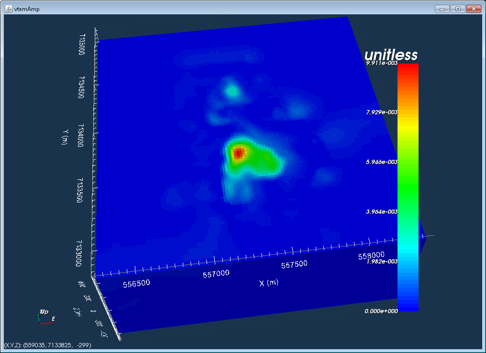

.. _IsoSurfaceToGeoModel:

.. include:: <isonum.txt>

Create a geology model from an isosurface
=========================================

In GIFtools, a geologic model can be generated from any physical property model (e.g., a density contrast model or a conductivity model). This recipe outlines the steps to create a geologic model based on isosurfaces from a physical property model.

Open GIFtools and if desired, :ref:`set the working directory <projSetWorkDir>`.

In this recipe, the example uses a 3D mesh and a susceptibility model. :ref:`Import the 3D mesh <importMesh3D>` and then :ref:`import the corresponding model <importModel>`.

:ref:`View the model <objectModelView>` and decide what the physical property values are for the isosurfaces(s). The figure below shows the example model used in this recipe.

For this example, there will be a single isosurface at 0.002 SI. This means this geologic model will have two units: 

#. Background (cells with susceptibility between 0 and 0.002 SI)
#. Anomaly (cells with susceptibility 0.002 SI and up)

To create a geology model, we need to :ref:`create a ModelBuilder module <createModelBuilder>`. In this example, we generate an active model from the susceptibility model: **Model** |rarr| **Create** |rarr| **Active topography model from air values**

GIFtools will ask for the value of the air cells in the selected model, which here is -100. A tolerance is also requested.

An active model can be generated in other ways too. To create active cells models from a mesh, see :ref:`this page <createActiveCellsModel>`.

The figure below shows the active model, with values of 1 for active cells (below topography) and 0 for inactive cells (above topography).

Now, start Modelbuilder.

To create a geologic model from an isosurface: **Create model** |rarr| **Geology model from** |rarr| **GIF models**.

The following window will pop up:

The first panel in the window deals with the models that are currently in the project. The available models are shown on the left, and in this case, there is only 1 model in the project, called "vtemAmp". To choose the model, highlight it and click the right arrow to move it to the right. In case for log-spaced models (e.g., conductivity), click the check button for "Specify log-spaced models".

The second panel provided options on how to group or cluster cells in the model. K-means and Fuzzy C-means are algorithms that will choose the boundaries for different groups. The third option is to provide a set of user defined boundaries. For each method, the number of groups is required. In this example, we choose "User defined boundaries" and 2 for the "Number of groups".

The last panel asks for a new model name. In this example, we will call the geologic model "geomod". The figure below shows the completed window for this example:

Click OK. Then pops up the following window:

In this window, we define the upper and lower boundaries for each of the groups. Here, group 1 will be the background and group 2 will be the anomaly. Thus, the maximum value for group 1 will be 0.002 SI. The minimum value will be a small enough value such that all cells with a value lower than the max are included. We choose -10000. For group 2, the minimum value is 0.002 SI. We want to include all cells than have a susceptibility higher than the minimum so we will set to maximum to 10000 to ensure we have all those cells.

The window then looks like:

Click OK to set the group values. A new GEOmodel will appear in the Model Builder folder with the name we gave it.

.. note:: The number of units in the new GEOmodel is 3! How come? We had only defined 2 groups. If the model is now viewed, there are indeed 3 units. Unit 1 is the background (less than 0.002 SI), unit 2 is the anomaly (greater than 0.002 SI), and unit 0 are the cells above the topography (air cells).

The geologic model contains three units (1 = background, 2 = anomaly, and 0 = air). The boundary between units 1 and 2 occurs where the susceptibility model was 0.002 SI. The following figures show a cross-section and plan view through the geologic model.

This final figure shows the anomalous unit when the air and background units are cut-off.

Now we have a geologic model that was based on the isosurface of a physical property model. We can look at the geology definition for this model: **Geology Model** |rarr| **Geology definition** |rarr| **Edit**, which brings up the following window.

.. figure:: ../../../images/IsoToGeoMod/geodef.png
    :align: center
    :figwidth: 75%

The geology definition shows the minimum and maximum values for each unit.

