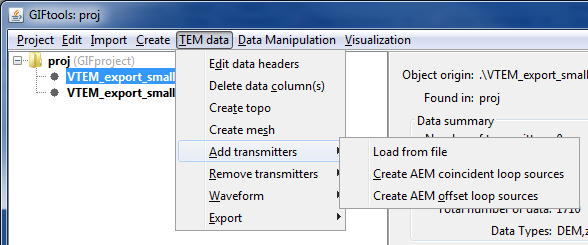
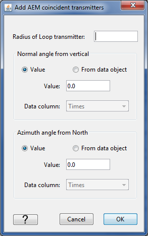
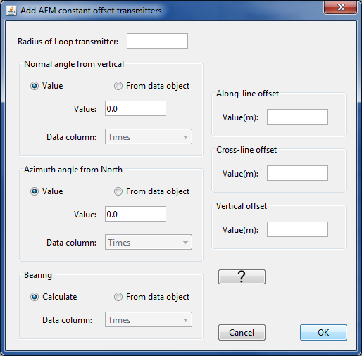
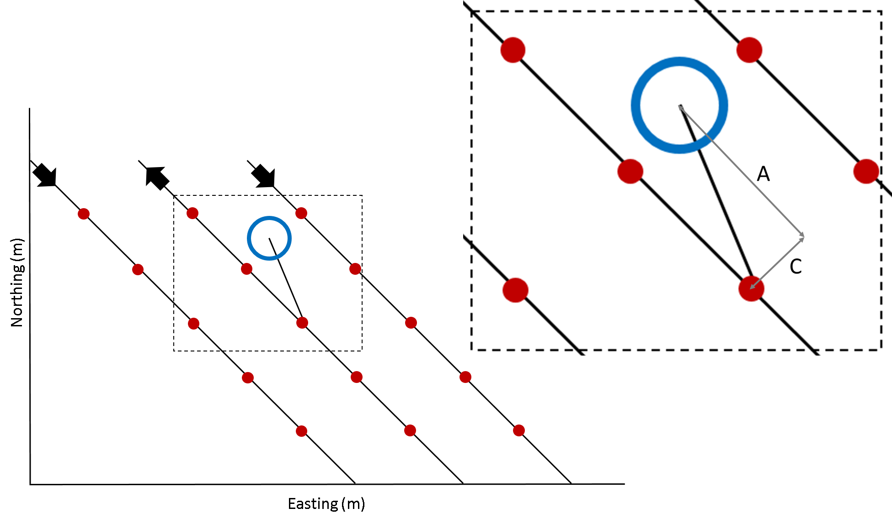

.. _addTxToTEMdata:

.. include:: <isonum.txt>

Add transmitter information to a TEM data object
================================================

After a :ref:`time-domain EM data from a csv or xyz file <importVTEMdata>` has been imported into GIFtools, the transmitter information is still missing in the TEMdata object. This recipe steps through adding in the transmitter information in three different ways:

#. Loading a file

#. Creating airborne EM (AEM) coincident loop sources

#. Creating AEM offset loop sources

To add transmitters to a TEM data object, use the menus: **TEM data** |rarr| **Add transmitters** and select the desired method.

Loading a transmitter file
--------------------------

The transmitter file uses a "block" format. The types of EM transmitters available are:

- Large-loop,

- Line-current,

- Dipole, and

- Loop

Refer to the :ref:`EM transmitter formats page <emTransmitters>` for detailed information. Each transmitter will have its own "block" in the transmitters file.

Add AEM coincident loop sources
------------------------------------

The second option is to add coincident loop sources and when selected, the following dialog pops up:

The first field requires the radius of the loop transmitter in meters. The second field asks for the normal angle from the vertical of the transmitter. This can either be provided as a value (in degrees) or as a column from the data object (for example, in the case where the angle changed during survey collection and was recorded). The third field requests the azimuth angle from north. This is again a value (in degrees) or a column selected from the data object.

Click ok to assign the transmitters to the TEMdata object.

.. note:: If you have a large data set, it may take some time to calculate all the transmitter locations and assign them!

There is also a video that shows this functionality: :ref:`video tutorial <VTtemdata>`

Add AEM offset loop sources
--------------------------------

The fields for the radius, normal angle from the vertical, and the azimuth angle from north require the same information as described for the coincident loop above.

The bearing of the survey lines can be calculated directly from the data or provided from a column. The bearing should be in degrees.

The along-line, cross-line, and vertical offsets are values given in meters. The vertical offset is the vertical distance between the transmitter and the receiver. If the transmitter is above the receiver, this value should be positive. The along-line offset is how much the transmitter is in front of the receiver (positive in meters) or behind the receiver (negative in meters). The cross-line offset describes how much the receiver is to either side of the line. The following diagram shows the along-line (A) and cross-line (C) offset definitions:

                
        The figure shows the along-line (A) and cross-line (C) offsets for a transmitter (blue circle) and a receiver (red dot) along a flight line (black). The thick arrows indicate the flight direction along the line.

Click ok to assign the transmitters to the TEMdata object.

There is also a video that shows this functionality: :ref:`video tutorial <VTtemdata>`

.. note:: If you have a large data set, it may take some time to calculate all the transmitter locations and assign them!

Additional notes and tips
-------------------------

.. note:: When creating AEM offset loop sources, you can double check that the location of the source is correct. Do this by viewing the sources and receivers in the VTK viewer. Click **Sources** in the control panel to view the source locations.

.. tip:: If you have a large data set loaded into GIFtools and plan to downsample the data before inversion, it is recommended to **first** downsample and **then** assign transmitters to safe computation costs.
