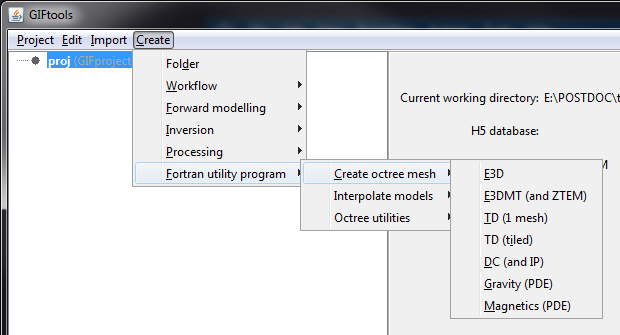
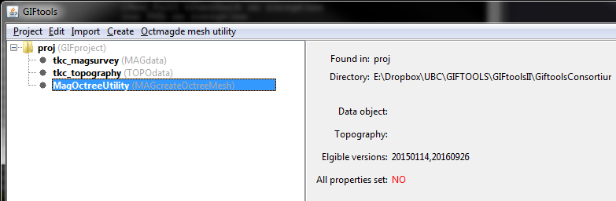
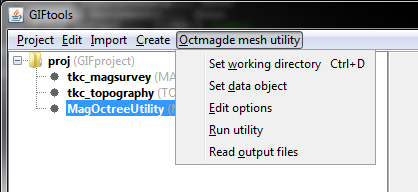
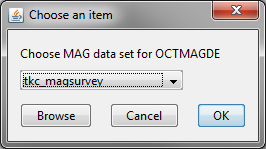
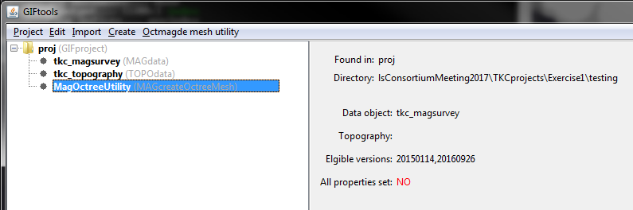
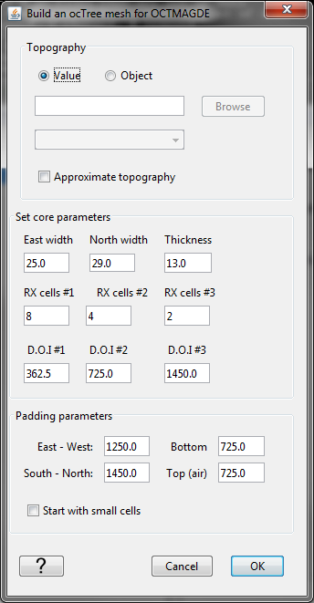
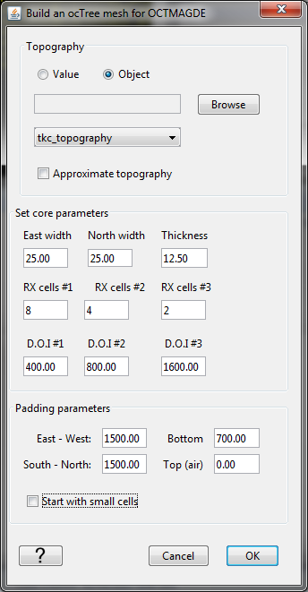
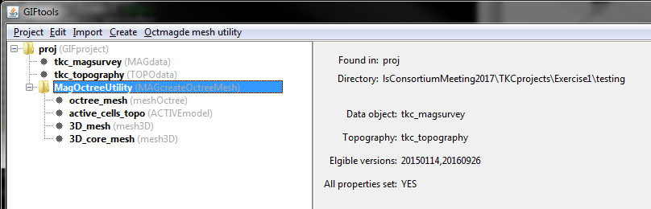

.. _createoctreemesh:

.. include:: <isonum.txt>

Create an octree mesh using a Fortran utility
=============================================

Each of the GIF octree codes comes with a utility to create an octree mesh. As of Version 2.1, the Fortran utilities to create octree meshes can be used through GIFtools. The figure below shows the menu structure for the available utilities.

The components to generate an octree mesh are generally the same, regardless of which code the mesh is generated for. The required files are:

- survey locations
- topography

This recipe steps through creating an octree mesh, starting from importing the necessary data, to setting the options, and running the Fortran utility. In addition, we explain the different parameters required for the octree mesh and the generated output files.

.. note:: The manuals for the octree codes explain the required parameters in detail for the create mesh utilities and will provide more technical information than is provided in this recipe. See the `GIF documentation page <http://gif.eos.ubc.ca/documentation>`_ to find the appropriate manual.

The example used in this recipe uses a magnetic airborne survey. The example files and complete project are available for download at the bottom of this page.

Step 1
------

Start GIFtools or open an already existing project. Because we will be loading in a few files, it is easiest to :ref:`set the working directory <utilSetWorkDir>` to the folder where the files are located and/or where you would like to generate the octree mesh.

The first step is then to import the magnetic airborne survey locations and the topography file. :ref:`Importation of data <importData>` will slightly differ, depending on the file type (GIF format, XYZ, etc). For this example, the magnetic survey file is structured as a XYZs while the topography file is in GIF format. Both are imported using the following menus:

- For magnetic survey locations: **Import** |rarr| **Data** |rarr| **Magnetics** |rarr| XYZ
- For topography: **Import** |rarr| **Data** |rarr| **Topography** |rarr| 3D GIF (3D XYZ)

.. figure:: ../../../images/createOctreeMesh/importdata.png
        :figwidth: 75%
        :align: center

For the magnetic data, we also need to :ref:`set the inclination, declination, and field strength <objectEditFieldParam>`. This can be done through the data manipulation menu.

Once the data are loaded, GIFtools will have the two items shown in the project tree on the left:

.. figure:: ../../../images/createOctreeMesh/step1.png
        :figwidth: 75%
        :align: center

:ref:`Save <projSave>` the project!

Step 2
------

With the data imported, we can create the octree mesh utility. To do so, use the menus and choose the appropriate code. For this example, we are using **Magnetics (PDE)**:

GIFtools will prompt you to choose a working directory for the mesh creation. Pick a location and click **Open** in the dialog. You will then see the create mesh item added to the GIFtools project tree:

At this point, the data object and topography have not been assigned. The info panel also shows which versions are currently supported. As well, we see that not all properties are set yet.

The menus for the create octree mesh utilities all look the same. Using the magnetics example, the menu allows you to change the working directory, set the data object, edit the utility options, run the utility, and load the output files.

Select **Set data object** from the menu. For magnetics, the following dialog appears:

For other methods, you will see similar dialogs to select the appropriate data type. For example, for TDoctree, you will be asked to select a TEMdata object.

Select the desired data set and click OK. The info panel will update, showing the selected data set.

Now use the menu again and select **Edit options**. This brings up the following dialog:

For some utilities, GIFtools will try to pre-fill the text boxes based on the assigned data. These should always be reviewed!

Choose the type of **topography: value or an object**. If a value, enter the value in the text box. If an object, select the item from the drop-down menu or browse for a GIF formatted file.

In addition, for this utility, there is a check box to choose **Approximate topography**. This option allows you to control the number of cells that are used to define topography in the padding cell region. If left unchecked, the utility will use "good topography", meaning the topography will be defined very accurately in the padding region using a large number of fine cells. If checked, the utility will approximate the topography using a smaller number of coarser cells.

The next part is to set the core parameters for the mesh. The **east width**, **north width**, and **thickness** describe the dimensions of the smallest cells in the mesh.

The **RX cells #1** gives the number of smallest cells around each receiver. Then **RX cells #2** gives the number of second-smallest cells around the set of smallest cells described by **RX cells #1**. The second-smallest cells are twice as big as first (for example, 2*east width). Finally, **RX cells #3** gives the number of third-smallest cells around the receiver. These cells are four times as big as the smallest cells (for example, 2*2*east width). These parameters allow you to control how quickly the cell sizes expand around the receiver.

The next part describes the depth of investigation (DOI) for the core mesh. The first value (**DOI #1**) is the depth below topography that should be filled with the smallest cells. Then, **DOI #2** is the thickness below DOI #1 that should be filled with the second-smallest cells. Finally, **DOI #3** is the thickness below DOI #2 that should be filled with the third-smallest cells. These parameter allow the user to control how quickly the cell sizes expand in depth.

The bottom part of the dialog deals with the **padding parameters**. The padding parameters are given in meters for the **east-west**, **south-north**, **bottom**, and **top (air)** directions.

Additionally, there is a checkbox at the bottom of the dialog, depending on the utility used. For potential fields, the checkbox gives the option to **start with small cells** (checked) or start with large cells (unchecked). In general, it is better to start with large cells and allow the code to refine the mesh as needed. If checked, the initial mesh will be with the smallest cell sizes, which can create a mesh with a very large number of cells and slow down the utility computation.

For other codes like **E3D** and **TDoctree**, there will be a checkbox to **shift data above discretized topo**. This creates a locations file with survey locations on the surface of the Earth and prevents ground receivers/transmitters from being below the Earth due to the discretization of the topography.

For the example here, we have completed the dialog with the following parameters:

Once all parameters are configured, click OK. If needed, you can use the menu to edit options, see the input parameters you provided, and change them if desired.

After clicking OK, the dialog will close and the info panel will be updated so show the topography used. At this point, the info panel shows that all properties have been set (changed from a **red no** to a **black yes**).

:ref:`Save <projSave>` the project!

Step 3
------

With all parameters set, we are ready to run the utility. Use the menu again and select **Run utility**. A dialog will pop up to show that it is running.

When done, the dialog will close and if all goes well, a new dialog will appear, saying the utility ran successfully. Click OK.

To import the generated files, use the menu and select **Read output files**. This loads the files from the working directory into GIFtools. In general, there are four files that are imported into GIFtools from a create octree mesh utility:

- octree_mesh : the generated octree mesh (meshOctree)
- active_cells_topo : an ACTIVEmodel item that has 0's above topography and 1's below. This file will likely also be required when running an octree forward modelling or inversion.
- 3D_mesh : a mesh3D item that is the same extents as the octree mesh but contains only the smallest cells. **Warning**: this mesh is likely **very large** and we do not recommend using it.
- 3D_core_mesh: a mesh3D item that is comprised of the smallest cells with its extents just covering the core portion of the octree mesh. **Tip**: this mesh can be useful for building models onto and then interpolating onto the octree mesh. **Tip**: this mesh can also be useful to transfer octree models onto to then export and visualize in software programs that don't support octree meshes/models.

For the magnetic example used in this recipe, GIFtools looks as following after loading the files into GIFtools:

:ref:`Save <projSave>` the project!

.. example:: The magnetics survey file, topography file, and field parameter notes along with a GIFtools project to repeat the above steps to create an octree mesh using the Fortran utility: `download <https://www.eoas.ubc.ca/~sdevries/GIFtoolsExamples/CreateOctreeMesh_Example.zip>`__

