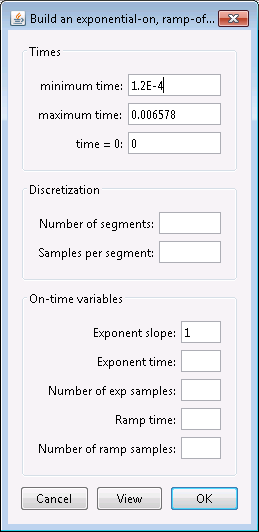

.. _createTEMwaveform:

.. include:: <isonum.txt>

Create a waveform for a TEM data set
====================================

In this recipe, we go through the steps to create a waveform for a TEM dataset. For the TDoctree and H3DTD codes, the same wave file is used for all transmitters. The discretization of the waveform is not trivial and this recipe aims to help step through creating an appropriate waveform. 

The discretization of the waveform in the on-time and discretization of the off-time is of great importance. A new factorization of the modelling matrix is required whenever the stepping time (:math:`\Delta t`) is changed. The most computationally efficient discretization is when a single value of :math:`\Delta t` can be used for the full time range of interest. Most systems consists of an on-time portion (exponential, half-sign, ramp, etc) followed by an off-time. The on-time portion of the waveform may be modelled using a large value of :math:`\Delta t`. Data acquired in the off-time often spans a few decades of time, as shown below.

        Example: off-time steps (blue) shown vs actual off-time data acquisition time gates for a VTEM system (red)

Maxwell's equations must be time-stepped with relatively small values of :math:`\Delta t`. The stepping time region begins one decade prior to the user-defined earliest time, and extends until the latest data time is defined. It is divided into logarithmic segments, usually a decade in length. Each segment is time-stepped with a uniform :math:`\Delta t` (linearly spaced). Generally 10-15 steps are adequate for each decade in time. The total computation time depends upon the number of factorizations, the number of time steps, and the number of transmitters.

GIFtools has a utility to assist the user in generating a wave file. This utility is based on the original Fortran utility called "Wavebuilder.exe". The utility can be accessed once a TEM data set has been loaded into GIFtools. Use the menu to navigate to the waveform menu, as shown below:

**TEM data** |rarr| **Waveform**

The waveform menu has five items:

#. Create exponent on; ramp off
#. Create step off
#. Import
#. View
#. Export

Below we go through each of these menu items.

Importing an existing waveform
------------------------------

The "Import" function allows you to import an existing waveform file in GIF format. GIF format for a waveform is as follows:

The file consists of two columns where the first column is time (seconds) and the second column is current (amperes). These time should be relative to the time channels in the data. The on-time pulse can be in the negative domain, as shown in the example above. Also in the example above, we see that current shut-off occurs at 0 seconds and the current remains at 0 in the off-time.

Such a file can be imported into GIFtools using the menu: **TEM data** |rarr| **Waveform** |rarr| **Import**

Creating a waveform with an exponential on-ramp, linear off-ramp
----------------------------------------------------------------

The first waveform we will create has an exponential on-ramp, following by a linear off-ramp in the on-time part of the waveform. This is a general expression that can approximate the waveform for many systems. Using the waveform menu, select the first item "Create exponent on; ramp off" to open the following dialog.

The dialog consists of three parts: "Times", "Discretization", and "On-time variables". Let's first look at the "Times" part. 

The minimum time and maximum time denote the minimum and maximum time channel values obtained from the TEMdata object. GIFtools will automatically subtract a decade from the minimum value to ensure there is at least one decade of time before the first time channel. The maximum value can be the same as the last time channel for H3DTD. The field for "time = 0" indicates the time for current shut-off, which in the example is 0 seconds.

The second part of the dialog defines the discretization of the waveform in the off-time. The number of segments is the number of logarithmically spaced segments and the number of samples per segment is the linearly spaced sampled per each segment.

The third part of the dialog defined the on-time portion of the waveform. The on-time portion has an exponential rise in current, followed by a linear ramp-off. The ramp-on is defined by the following expression:

.. math:: I = 1 - exp(-\alpha t/T),

where :math:`I` is the current (amperes), :math:`a` is the user-defined exponential decay coefficient ("exponent slope" in the dialog), :math:`T` is the user-defined length in time of the exponential ramp-on ("exponent time" in the dialog), and :math:`t` is the time (seconds). Thus, the exponential ramp is defined for 0 < :math:`t` < :math:`T`. For later time, the waveform is a linear ramp-off and its length is defined in the box "ramp time" in the dialog. The end of the ramp is adjusted so that it corresponds to "time = 0". The dialog has two more fields to set the number of samples for the exponential part and the number of samples for the off-ramp part.

For this example, we complete the dialog as following:

.. figure:: ../../../images/createWaveform/createExp2.png
        :align: center
        :figwidth: 50%

Click the view button to view the waveform using these parameters:

GIFtools shows the on-time and off-time parts of the created waveform. The on-time part is plotted on a linear time scale while the off-time is plotted on a logarithmic time scale. The vertical axis in both is the current amplitude, which is zero for the off-time and shows the exponential ramp-on and linear ramp-off for the on-time.

#. The end of the on-time (or current shut-off) is specified by the "time = 0" field from the dialog, which was 0 in this case. 
#. The exponential on-ramp defined by the equation above and the parameters "exponent slope" and "exponent time" specified in the dialog. The number of segment points was also defined in the dialog (in this example, we used 10).
#. The linear off-ramp defined by the parameter "ramp time" in the dialog. The number of segment points was also defined in the dialog (in this example, we used 5).
#. The maximum current is 1 A since data for GIF codes should be normalized by the current.
#. In the off-time, we see the "number of segments" (defined as 3 in this example) and the "samples per segment" (defined as 7 in this example).

Close the viewing window and edit the waveform parameters, if needed. Once satisfied, click OK to set the waveform for the TEMdata object.

Creating a step-off waveform
----------------------------

The first waveform that can be created within GIFtools is a step-off function. This is a reverse Heaviside function and the simplest waveform to model. No actual geophysical system uses this exact waveform; however, recorded signals can often be deconvolved to conform to this waveform type. Peak current (maximum current) data are generally sampled only in the logarithmic domain. Using the waveform menu, select the second item "Create step off" to open the following dialog.

The dialog consists of two parts: "Times" and "Discretization". Note that this dialog is almost identical to the dialog to create an exponential on-ramp/linear off-ramp waveform but simpler as here, we do not need any information for the on-time part. Let's first look at the "Times" part. 

The minimum time and maximum time denote the minimum and maximum time channel values obtained from the TEMdata object. GIFtools will automatically subtract a decade from the minimum value to ensure there is at least one decade of time before the first time channel. The maximum value can be the same as the last time channel for H3DTD. The field for "time = 0" indicates the time for current shut-off, which in the example is 0 seconds.

The second part of the dialog defines the discretization of the waveform in the off-time. The number of segments is the number of logarithmically spaced segments and the number of samples per segment is the linearly spaced sampled per each segment.

For this example, we complete the dialog as following:

Click the view button to view the waveform using these parameters:

GIFtools shows the on-time and off-time parts of the created waveform. The on-time part is plotted on a linear time scale while the off-time is plotted on a logarithmic time scale. The vertical axis in both is the current amplitude, which is zero for the off-time and shows a single point for the on-time.

#. The on-time is defined as a single point at "time = 0" with a current of 1 A.
#. In the off-time, we see the "number of segments" (defined as 3 in this example) and the "samples per segment" (defined as 7 in this example).

Close the viewing window and edit the waveform parameters, if needed. Once satisfied, click OK to set the waveform for the TEMdata object.

Viewing a waveform
------------------

To view a waveform that has been assigned to a TEMdata object, use the menu: **TEM data** |rarr| **Waveform** |rarr| **View**

Exporting a waveform
--------------------

To export a waveform to be used with H3DTD or TDoctree, use the menu: **TEM data** |rarr| **Waveform** |rarr| **Export**

