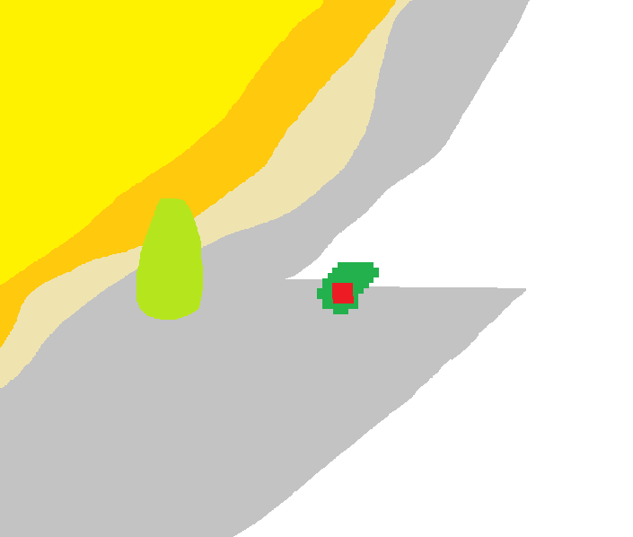
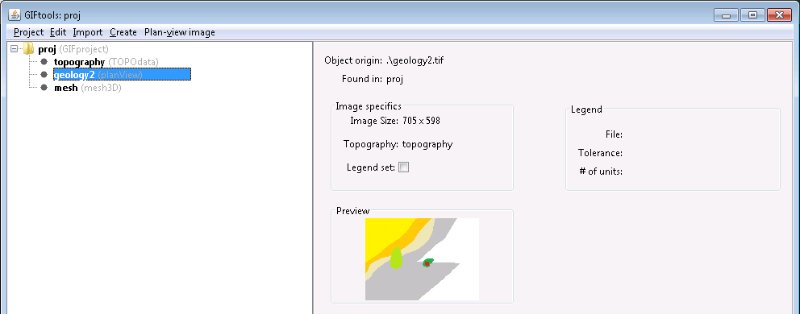
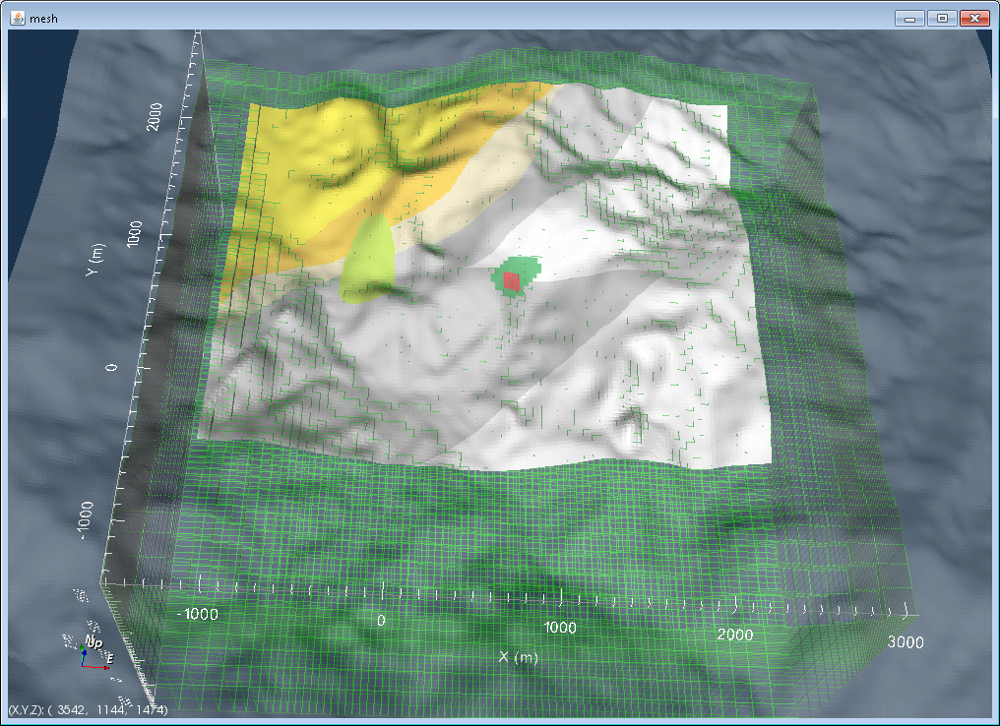
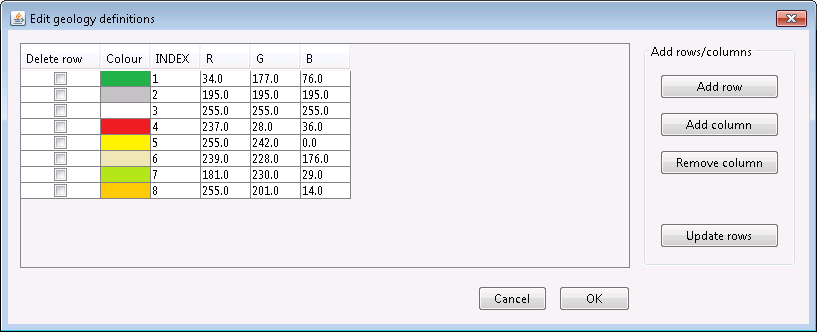
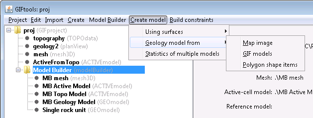
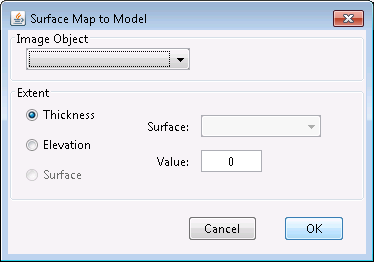
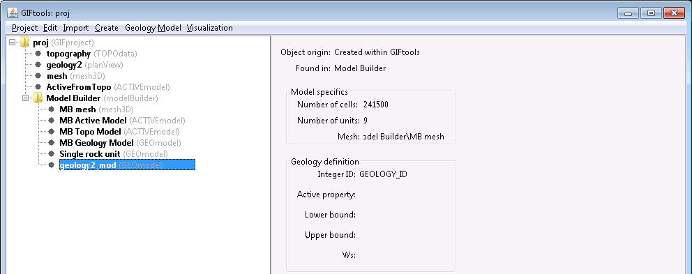
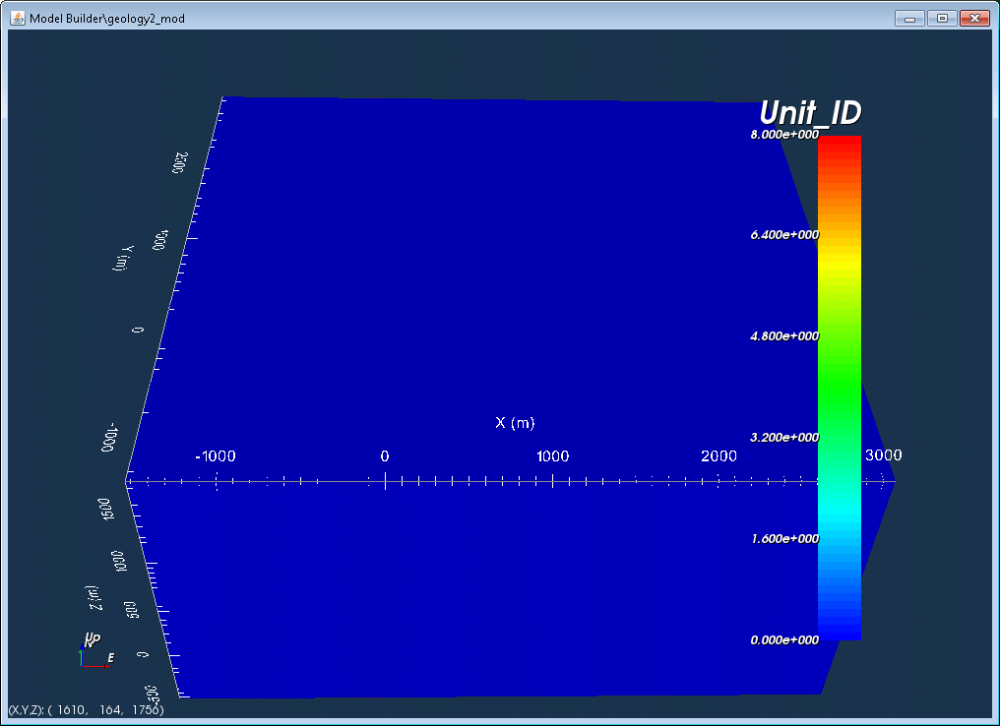
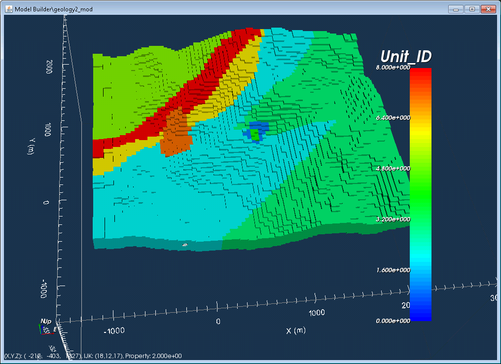

.. _imageInInversion:

.. include:: <isonum.txt>

Create a geologic model from a plan-view image
==============================================

GIFtools can import a geologic image and convert it to a geology model. This allows one to create upper and lower bound models, build weights, and create physical property models based on the geology. This is particularly useful for inversion of multiple data types in the same area. Below are the steps create a geology model from a plan-view image.

In GIFtools, :ref:`Import a geologic image <importGeoImage>`. The image should have solid colours indicating geologic zones (see below for example). The algorithms developed in GIFtools will struggle if annotations are included in the image.

In this example, the image file is called "geology2.tif" and the world file is called "geology2.tifw". We do not have a legend file so are not importing one. The topography for this is called "topography.dat". We also import a 3D mesh (called "mesh.msh") into the GIFtools project. The project tree looks like the following:

We can visualize the mesh, and then load in the topography and image over top:

Next, we need to define a legend for the image. If the legend file was not imported with the mesh, either :ref:`import or create <importLegendFile>` the image legend through the image menu. This file gives the ID and its corresponding colour code (RGB). In this example, we have to :ref:`create the legend <importLegendFile>`. The table then looks like:

Each colour identified in the image has an index and an RGB triplet. If we click OK, the table will close and the info panel for the geology image will now show a check mark next to "Legend set:".

Using the mesh, :ref:`create <createModelBuilder>` or use an already existing modelBuilder module (make sure it is on the mesh you want to use in an inversion or forward modelling). Because in our example, we did not already have a modelBuilder object, we created one with the 3D mesh and the topography. Then, we started the modelBuilder module.

.. _createGeoModelImage:

Click on the modelBuilder item in the project tree and use the following menus to create a geology model from an image:

   **Create model** |rarr| **Geology model from** |rarr| **Map image**

The following dialog opens up:

Select the image we want to use (in this case, geoglogy2). Then there are a few options on how to create the model:

1. Thickness: Specify a positive value that will be the thickness from the topography downwards. A thickness of 0 will extend the model down 1 cell beneath the topography.
2. Elevation: Specify a value and the model will extend from the topography to the lower elevation value.
3. Surface: Choose a surface item and the model will extend from the topography to the lower surface item.

In this example, we will choose a thickness of 200 m. Click OK.

Once the model has been created, it will appear in the project tree, within the modelBuilder folder. The model will have the image name followed by "_mod", which in this case is geology2_mod.

The GEOmodel can be viewed by using the Visualization menu. We see the following:

The geology model is zero wherever there was no information provided. In this example, the image did not stretch all the way to mesh extents and the mesh has more cells above and below the thickness of the image specified. Use the visualization controls to cut off zero values within the model.

Now we see the image, draped over the topography and extended 200 m in depth.

From here, you can use the geology model to :ref:`create a physical property model <propModelFromGeoModel>` (i.e., reference model, initial model, upper and lower bounds) or :ref:`create weights <weightsFromGeoModel>`.

.. example:: The files used in this recipe, along with the completed project can be downloaded `here <http://www.eoas.ubc.ca/~sdevries/GIFtoolsExamples/CreateGeoModelFromImage_Example.zip>`__.

