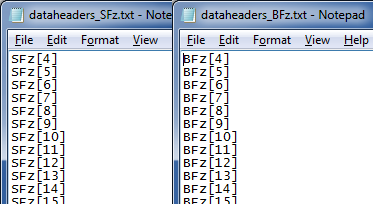

.. _importVTEMdata:

.. include:: <isonum.txt>

Import TEM data into GIFtools from XYZ or CSV file
==================================================

GIFtools can import time-domain EM data from a xyz or csv file in a few simple steps. This recipe uses a VTEM data set from a csv file. The first line in the file should be the data headers. Double check the file formats before starting: :ref:`csv file <CSVfile>` and :ref:`xyz file <XYZfile>`.

.. note:: If you have multiple component data and not all time channels are available for some components, GIFtools can handle that. This recipe uses an example where the x component data has less time channels than the z component.

Start GIFtools or open an already existing project. Because we will be loading in a number of files, it is easiest to set the working directory to the folder where the files are located.

To set the working directory: **Project** |rarr| **Set properties** |rarr| **Set working directory** or use the shortcut command **Control+Shift+D**

Now, let's start importing the TEM data: **Import** |rarr| **Data** |rarr| **Time-domain EM**

There are several data formats to choose from. In this recipe, we focus on importing from a XYZ or a csv file. The steps are the same for both data formats. The example used here is from a csv file:  **Import** |rarr| **Data** |rarr| **Time-domain EM** |rarr| **CSV file**.

The following GUI will pop up:

.. figure:: ../../../images/importTEMdata/importTEMdata.png
        :figwidth: 75%
        :align: center

Step 1
------

Click on the "Step 1" button. The following GUI will pop up.

Choose the appropriate headers from the drop-down menus for Easting, Northing, and Elevation. For our example, this is X, Y, and DEM.

Next, add in the time channel information. This can be done in two ways: (1) Manually add the time channel information by clicking the plus or minus buttons to increase or decrease the number of time channels. Then the time can be entered in the second column. (2) Alternatively, you can load a text file that contains the time channels, as shown below.

To load in a file with the time channels, click "Load text file" and select the desired file. The GUI will update with the number of times and the time channels. In the case of our example, there are 45 time chanels, ranging from 0.021 to 10.667 ms.

.. note:: These units will have to be changed before inversion of the data, but this can easily be done using the **Data manipulation** menu once the data is loaded into GIFtools.

The final step is to select the number of data groups. For this example, there are 4: the horizontal and vertical components of the time derivative of the magnetic field (dB/dt) and the magnetic field (B), In our example, these are denoted as SFx, SFz, BFx, and BFz in the headers of the csv file. Click the plus or minus buttons to increase or decrease the desired number of data groups.

Once this information is entered, our GUI looks like:

Click OK and move on to Step 2.

Step 2
------

With Step 1 complete, the GUI shows the number of data types selected. For our example, that's 4 data groups. Select the first data type to specify from the drop down menu. It will be called "Data type 1". Click the "Specify type" button and the following window will appear:

Here, you can change the header name for this data group from "Data type 1" to your desired name. For our example, we've chosen "SFz". There are 2 ways to assign the header for each time channel:

1. Click on the empty cell below "Header" and a drop-down menu will appear. Select the desired header name. Repeat for each time channel. If there is no header associated for a particular time channel (i.e., there is no data associated with that time channel), leave the header field blank. For our example, the first header is "SFz[4]", as shown below:

2. The faster method is click the "Load headers" button and select a file containing all the headers. The file format for the headers is shown below for two of the four data groups in our example. The headers in these files are SFz[4]-SFz[48] and BFz[4]-BFz[48]. This automatically fills in the header column, as shown in the second figure below.

.. figure:: ../../../images/importTEMdata/loadStep2_3.png
        :align: center
        :figwidth: 50%

In the case where there are more time channels than headers, leave a blank line in the header file, as shown below. This will then not associate a header with that time channel and assign a dummy value as the data value when finished loading into GIFtools. In our example, there is only x component data for time channels 20-48, so the header file contains the headers SFx[20]-SFx[48] with blank lines above the first header.

.. figure:: ../../../images/importTEMdata/loadStep2_3b.png
        :align: center
        :figwidth: 50%

Once the headers have been added for this data group, click OK. You should now see that the first data group's name has been updated (if you changed it) and it has been assigned.

Repeat these steps for any remaining data types and then move on to Step 3.

Step 3
------
When all data types are assigned in Step 2, any remaining data columns detected in the file will appear as miscellaneous data in Step 3. The figure below shows what this looks like for our example. Here, you can select additional data to import. In our case, we've selected 4 additional columns of data, as shown below.

.. NOTE:: If the data columns contain anything other than numbers, importation may not succeed. For this reason, we are not importing the column "Line" above because the data in the csv file are of the format "L000".

Load the data
-------------

When everything is selected as desired, click OK to load in the time-domain EM data into GIFtools.

.. tip:: Depending on the size of the file, loading the data may take some time!

After the data has been loaded, the TEMdata object will appear in the GIFtools GUI, as shown below.

Additional notes and tips
-------------------------

.. tip:: The TEM data is now loaded into GIFtools but the transmitter information has not been added. See the recipe for :ref:`adding transmitters to TEM data <addTxToTEMdata>`.

.. tip:: If any figures are too small to read, right-click and open the image in a new tab!

